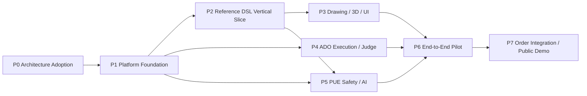

# ASXEED ADO TASK GRAPH v1.2

**対象:** ADO / ASXEED Manufacturing OS / Platform Contracts  
**上位基準:** `ASXEED_Architecture_Freeze_v1.1.md` → Technology Baseline v1.0 → `MASTER_IMPLEMENTATION_PLAN_v1.2.md`  
**基準日:** 2026-07-29  
**状態:** Architecture Freeze準拠・実行計画  
**Task数:** 103（Phase Gateを含む）  
**依存関係検証:** 参照漏れ0・循環0  

---

## 1. 目的

本書は、Master Implementation PlanをADOが安全に実行できる固定Task ID、明示的依存関係、Risk、Approval、Acceptance Criteriaへ分解した実行グラフである。自然言語の「前のTask」「上記Task」のような曖昧な依存参照は禁止し、`dependsOn`には本書で定義したTask IDだけを使用する。

機械取込み用の正本は同時生成された `ADO_TASK_GRAPH_v1.2.json` とし、本書は人間レビュー用の正本とする。両者のTask IDと依存関係は同一生成元から作成されている。

## 2. 実行規則

- Phase Gateを通過するまで、次PhaseのTaskを`ready`にしない。
- 1 Task = 1 Repository = 1明確な成果 = 原則1 Draft PR。
- Cross-repository変更はContract Release後にConsumer Taskを開始する。
- `mandatory`承認TaskはHuman Approvalなしに完了・Merge・Releaseしない。
- 自動Fixは最大2回。Architecture、Security、Critical製造判断はAI CTO Design Reviewへ戻す。
- Taskの実装完了だけでは`completed`にせず、Verification ArtifactとJudge Resultが必要。
- 下位TaskがArchitecture FreezeまたはADRと衝突した場合、Taskを停止する。

## 3. Task Lifecycle

```text
planned → created → assigned → running → completed → judging → review → approved → merged
                                  ↘ fixing ↗
                                  ↘ waiting_design
                                  ↘ waiting_approval
                                  ↘ blocked
```

## 4. Global Dependency Spine



### 並列実行の主軸

```text
P1完了後
├─ Track B：P2 → P3  Reference DSLによる下流Vertical Slice
├─ ADO Track：P4       Codex・Judge・Approval Loop
└─ Track A：P5前半     Secure Intake・OCR・Evidence（P2 Contractを参照）

P3・P4・P5完了後
└─ P6 End-to-End Pilotで統合
```


## 4.1 Program / Track Mapping

各TaskはJSON版の`programId`と`trackId`を正本として、3 Programと共通Foundationへ分類する。

| Phase / Task群 | programId | trackId |
|---|---|---|
| P0 | COMMON-FOUNDATION | ARCHITECTURE-ADOPTION |
| P1通常Task | COMMON-FOUNDATION | PLATFORM-FOUNDATION |
| P1-TS01〜TS07 | COMMON-FOUNDATION | TECHNOLOGY-VALIDATION |
| P2 | PROGRAM-2 | REFERENCE-DSL-VERTICAL-SLICE |
| P3 Drawing / 3D Core | PROGRAM-2 | DRAWING-3D-CORE |
| P3 Product UI | PROGRAM-3 | PRODUCT-UI-UX |
| P4 | PROGRAM-1 | ADO-CONTROL-PLANE-MVP |
| P5 | PROGRAM-2 | PUE-SAFETY |
| P6 | PORTFOLIO | END-TO-END-PILOT |
| P7 Order | PROGRAM-2 | ORDER-INTEGRATION |
| P7 Demo | PROGRAM-3 | PUBLIC-DEMO |


## 4.2 Sprint Mapping

Sprintは原則1週間の時間管理単位であり、依存関係の正本は`dependsOn`である。全Taskの`sprintId`はJSON版を正本とする。

| Sprint | Name | Task IDs | Milestone |
|---|---|---|---|
| `SPRINT-00` | Architecture Operational | `P0-T01`, `P0-T02`, `P0-T03`, `P0-T04`, `P0-T05`, `P0-T06`, `P0-GATE` | M0 Architecture Operational |
| `SPRINT-01` | Platform Contracts and Technology Validation | `P1-T01`, `P1-T02`, `P1-T03`, `P1-T04`, `P1-T05`, `P1-T06`, `P1-T07`, `P1-TS01`, `P1-TS02`, `P1-TS03`, `P1-TS04`, `P1-TS05`, `P1-TS06`, `P1-TS07` | M1前半 Platform Contract Baseline |
| `SPRINT-02` | Cloud, Security and Workflow Foundation | `P1-T08`, `P1-T09`, `P1-T10`, `P1-T11`, `P1-T12`, `P1-T13`, `P1-T14`, `P1-T15`, `P1-T16`, `P1-T17`, `P1-GATE` | M1 Cloud Foundation |
| `SPRINT-03` | DSL and ADO Execution Foundations | `P2-T01`, `P2-T02`, `P2-T03`, `P2-T04`, `P2-T05`, `P2-T06`, `P2-T07`, `P4-T01`, `P4-T02`, `P4-T03`, `P4-T04` | M2前半 Rule Runtime / M4前半 ADO Runner |
| `SPRINT-04` | Parts, Geometry, Judges and PUE Intake | `P2-T08`, `P2-T09`, `P2-T10`, `P2-T11`, `P2-GATE`, `P4-T05`, `P4-T06`, `P4-T07`, `P5-T01`, `P5-T02`, `P5-T03`, `P5-T04`, `P5-T05` | M2 Manufacturing Core |
| `SPRINT-05` | Drawing, 3D, Product UI and Approval Loop | `P3-T01`, `P3-T02`, `P3-T03`, `P3-T04`, `P3-T05`, `P3-T06`, `P3-T07`, `P3-T08`, `P3-T09`, `P3-T10`, `P4-T08`, `P4-T09`, `P4-T10`, `P4-T11`, `P4-T12`, `P4-GATE`, `P5-T06`, `P5-T07`, `P5-T08`, `P5-T09`, `P5-T10` | M4 ADO Approval Loop |
| `SPRINT-06` | Visual Manufacturing and Safe PUE Integration | `P3-T11`, `P3-T12`, `P3-T13`, `P3-GATE`, `P5-T11`, `P5-T12`, `P5-GATE` | M3 Visual Manufacturing / M5 Safe PUE |
| `SPRINT-07` | Pilot Readiness and Baseline Run | `P6-T01`, `P6-T02`, `P6-T03` | M6前半 Pilot Baseline |
| `SPRINT-08` | Pilot Quality, Resilience and Security | `P6-T04`, `P6-T05`, `P6-T06`, `P6-T07`, `P6-T08` | M6検証完了 |
| `SPRINT-09` | Operational UAT and Practical Prototype Gate | `P6-T09`, `P6-GATE` | M6 Practical Prototype |
| `SPRINT-10` | Order Integration and Public Demo Build | `P7-T01`, `P7-T02`, `P7-T03`, `P7-T04`, `P7-T05`, `P7-T06` | M7前半 Integration / Demo |
| `SPRINT-11` | Customer Demonstration and Beta Readiness | `P7-T07`, `P7-T08`, `P7-GATE` | M7 Customer Demonstration |

## 5. Phase Gate一覧

| Gate | Milestone | 主な依存 | 完了証拠 |
|---|---|---|---|
| `P0-GATE` | Architecture Adoption | `P0-T06` | judge-summary.json, rollback-plan.json |
| `P1-GATE` | Platform Foundation | `P1-T09`, `P1-T10`, `P1-T12`, `P1-T14`, `P1-T16`, `P1-T17` | judge-summary.json, rollback-plan.json |
| `P2-GATE` | Reference DSL Vertical Slice | `P2-T02`, `P2-T03`, `P2-T04`, `P2-T11` | judge-summary.json, benchmark-report.json, rollback-plan.json |
| `P3-GATE` | Drawing・3D・Manufacturing UI | `P3-T13` | judge-summary.json, rollback-plan.json |
| `P4-GATE` | ADO Execution・Judge Loop | `P4-T08`, `P4-T10`, `P4-T12` | judge-summary.json, release-report.json |
| `P5-GATE` | PUE Safety・AI Integration | `P5-T11`, `P5-T12` | judge-summary.json, evaluation-report.json, rollback-plan.json |
| `P6-GATE` | End-to-End Pilot | `P6-T09` | judge-summary.json, pilot-release-report.json |
| `P7-GATE` | Order Integration・Public Demo | `P7-T08` | judge-summary.json, demo-release-report.json |

## 6. Task Registry

Taskの完全な機械可読情報は `ADO_TASK_GRAPH_v1.2.json` に保存する。以下はレビューと実行判断に必要な要約である。

## P0：Architecture Adoption

Architecture FreezeをRepository Rule・CI・ADO Contractへ反映する。

| ID | Task | Repo | Agent | Depends On | Risk | Approval |
|---|---|---|---|---|---|---|
| `P0-T01` | Architecture Freeze文書を3 Repositoryへ配置 | `platform-contracts` | `architect` | none | medium | checkpoint |
| `P0-T02` | 各RepositoryのAGENTS.mdをArchitecture準拠へ更新 | `platform-contracts` | `architect` | `P0-T01` | high | checkpoint |
| `P0-T03` | ADO Task Contract v1を定義 | `platform-contracts` | `architect` | `P0-T01` | high | checkpoint |
| `P0-T04` | Architecture Rule Catalogを定義 | `platform-contracts` | `architect` | `P0-T01` | high | checkpoint |
| `P0-T05` | Architecture Judge Skeletonを実装 | `ado` | `implementer` | `P0-T03`, `P0-T04` | high | checkpoint |
| `P0-T06` | Architecture CheckをGitHub Required Check化 | `platform-contracts` | `implementer` | `P0-T02`, `P0-T05` | high | mandatory |
| `P0-GATE` | M0 Architecture Operational Gate | `platform-contracts` | `judge` | `P0-T06` | high | mandatory |

### P0-T01：Architecture Freeze v1.1・Technology Baseline文書を3 Repositoryへ配置

- **Repository:** `platform-contracts`
- **Program:** `COMMON-FOUNDATION`
- **Track:** `ARCHITECTURE-ADOPTION`
- **Agent:** `architect`
- **Risk:** `medium`
- **Human approval:** `checkpoint`
- **ADR:** `ADR-016`
- **Depends on:** none
- **Parallel group:** `P0-A`

Freeze、ADR、Technology Baseline、Master Plan、責任境界を各Repositoryの正式参照位置へ配置する。

**Outputs**
- docs/architecture/ASXEED_Architecture_Freeze_v1.1.md
- docs/architecture/TECHNOLOGY_STACK.md
- docs/architecture/TECHNOLOGY_VERSION_MATRIX.md
- docs/architecture/TECHNOLOGY_SELECTION_RATIONALE.md
- docs/architecture/DEFERRED_TECHNOLOGY.md
- docs/plans/MASTER_IMPLEMENTATION_PLAN_v1.2.md
- repository-responsibility.md

**Acceptance criteria**
- 3 Repositoryで同一VersionのFreezeを参照できる
- 文書階層と衝突時停止手順が明記される

### P0-T02：各RepositoryのAGENTS.mdをArchitecture準拠へ更新

- **Repository:** `platform-contracts`
- **Program:** `COMMON-FOUNDATION`
- **Track:** `ARCHITECTURE-ADOPTION`
- **Agent:** `architect`
- **Risk:** `high`
- **Human approval:** `checkpoint`
- **ADR:** `ADR-010`, `ADR-016`
- **Depends on:** `P0-T01`

Codexが独自設計せず、ADR・禁止事項・Artifact要件を守る統治文書を作る。

**Outputs**
- ADO AGENTS.md
- Manufacturing OS AGENTS.md
- Platform Contracts AGENTS.md

**Acceptance criteria**
- ADR参照が必須
- Architecture判断時の停止条件がある
- Main Merge・Production権限禁止が明記される

### P0-T03：ADO Task Contract v1を定義

- **Repository:** `platform-contracts`
- **Program:** `COMMON-FOUNDATION`
- **Track:** `ARCHITECTURE-ADOPTION`
- **Agent:** `architect`
- **Risk:** `high`
- **Human approval:** `checkpoint`
- **ADR:** `ADR-010`, `ADR-013`
- **Depends on:** `P0-T01`
- **Parallel group:** `P0-A`

Task ID、依存関係、Acceptance Criteria、Artifact、Approvalを機械可読化する。

**Outputs**
- ado-task.schema.json
- ado-task.example.json

**Acceptance criteria**
- dependsOnはTask ID配列
- ADR・Risk・Approval・Rollbackが必須
- Schema validationが通る

### P0-T04：Architecture Rule Catalogを定義

- **Repository:** `platform-contracts`
- **Program:** `COMMON-FOUNDATION`
- **Track:** `ARCHITECTURE-ADOPTION`
- **Agent:** `architect`
- **Risk:** `high`
- **Human approval:** `checkpoint`
- **ADR:** `ADR-001`, `ADR-002`, `ADR-009`, `ADR-012`, `ADR-013`
- **Depends on:** `P0-T01`
- **Parallel group:** `P0-A`

初期Architecture違反を安定したRule IDとして定義する。

**Outputs**
- architecture-rules.json
- prohibited-patterns.md

**Acceptance criteria**
- 最低7種類の違反Ruleがある
- 各RuleにSeverity・対象・修正方針がある

### P0-T05：Architecture Judge Skeletonを実装

- **Repository:** `ado`
- **Program:** `COMMON-FOUNDATION`
- **Track:** `ARCHITECTURE-ADOPTION`
- **Agent:** `implementer`
- **Risk:** `high`
- **Human approval:** `checkpoint`
- **ADR:** `ADR-010`, `ADR-015`
- **Depends on:** `P0-T03`, `P0-T04`

Repository Diffを解析してArchitecture Rule違反をReportするJudgeを作る。

**Outputs**
- architecture judge package
- architecture-report.json

**Acceptance criteria**
- 直接Domain importを検出
- 商品名分岐を検出
- 禁止Fieldとevalを検出
- ReportがJSON Schema準拠

**Required tests**
- unit
- fixture-based architecture violations

**Required artifacts**
- `architecture-report.json`

### P0-T06：Architecture CheckをGitHub Required Check化

- **Repository:** `platform-contracts`
- **Program:** `COMMON-FOUNDATION`
- **Track:** `ARCHITECTURE-ADOPTION`
- **Agent:** `implementer`
- **Risk:** `high`
- **Human approval:** `mandatory`
- **ADR:** `ADR-010`, `ADR-016`
- **Depends on:** `P0-T02`, `P0-T05`

Architecture Judgeを各RepositoryのPR Gateへ組み込む。

**Outputs**
- reusable architecture workflow
- branch protection setup guide

**Acceptance criteria**
- 3 RepositoryでCheckが毎回完了
- 違反PRがMerge不可
- not-applicableでも成功状態を返す

**Required tests**
- workflow smoke test

**Required artifacts**
- `ci-check-evidence.json`

### P0-GATE：M0 Architecture Operational Gate

- **Repository:** `platform-contracts`
- **Program:** `COMMON-FOUNDATION`
- **Track:** `ARCHITECTURE-ADOPTION`
- **Agent:** `judge`
- **Risk:** `high`
- **Human approval:** `mandatory`
- **ADR:** `ADR-010`, `ADR-015`
- **Depends on:** `P0-T06`

Phase 1開始前にArchitecture統治が実動することを確認する。

**Outputs**
- M0 gate report

**Acceptance criteria**
- Freeze参照が揃う
- Task Contractが有効
- Architecture違反をCIが停止
- Human Approval完了

**Required tests**
- cross-repository smoke

**Required artifacts**
- `judge-summary.json`
- `rollback-plan.json`

## P1：Platform Foundation

Cloud、Contract、Security、Workflow、Persistence、Observability基盤を構築する。

| ID | Task | Repo | Agent | Depends On | Risk | Approval |
|---|---|---|---|---|---|---|
| `P1-T01` | Platform Contracts Repository基盤を構築 | `platform-contracts` | `implementer` | `P0-GATE` | medium | checkpoint |
| `P1-T02` | Core Job・Artifact・Trace Contractを実装 | `platform-contracts` | `implementer` | `P1-T01` | high | checkpoint |
| `P1-T03` | Error・Approval・Verification・Event Contractを実装 | `platform-contracts` | `implementer` | `P1-T01` | high | checkpoint |
| `P1-T04` | Reusable CI Workflowを構築 | `platform-contracts` | `implementer` | `P1-T01`, `P0-T06` | high | checkpoint |
| `P1-T05` | ADO RepositoryをMonorepo構成へ整備 | `ado` | `implementer` | `P1-T02`, `P1-T03`, `P1-T04` | medium | checkpoint |
| `P1-T06` | Manufacturing OS RepositoryをMonorepo構成へ整備 | `manufacturing-os` | `implementer` | `P1-T02`, `P1-T03`, `P1-T04` | medium | checkpoint |
| `P1-T07` | 共通Bicep ModuleとEnvironment Parameterを作成 | `platform-contracts` | `implementer` | `P1-T01` | high | checkpoint |
| `P1-T08` | Development Cloud基盤をProvision | `platform-contracts` | `implementer` | `P1-T07`, `P1-TS07` | high | mandatory |
| `P1-T09` | Staging Environment SkeletonをProvision | `platform-contracts` | `implementer` | `P1-T08`, `P1-TS07` | high | mandatory |
| `P1-T10` | Entra ID LoginとRole Contractを実装 | `manufacturing-os` | `implementer` | `P1-T03`, `P1-T06`, `P1-T08` | high | mandatory |
| `P1-T11` | Managed Identity・Key Vault Accessを実装 | `platform-contracts` | `implementer` | `P1-T08` | high | mandatory |
| `P1-T12` | Quarantine StorageとMalware Scan基盤を構築 | `manufacturing-os` | `implementer` | `P1-T08`, `P1-T11` | high | mandatory |
| `P1-T13` | Prisma Domain SchemaとMigration基盤を構築 | `manufacturing-os` | `implementer` | `P1-T02`, `P1-T03`, `P1-T06`, `P1-T08`, `P1-TS05` | high | mandatory |
| `P1-T14` | Artifact Repository・Audit・Transaction Outboxを実装 | `manufacturing-os` | `implementer` | `P1-T02`, `P1-T03`, `P1-T13` | high | checkpoint |
| `P1-T15` | Temporal Namespace・Worker Runtimeを構築 | `ado` | `implementer` | `P1-T05`, `P1-T08`, `P1-T11` | high | checkpoint |
| `P1-T16` | Job API・Signal／Update／Query・SSEを実装 | `ado` | `implementer` | `P1-T02`, `P1-T03`, `P1-T15` | high | checkpoint |
| `P1-T17` | OpenTelemetry・Cost Attributionを実装 | `platform-contracts` | `implementer` | `P1-T02`, `P1-T08`, `P1-T15`, `P1-T16`, `P1-TS04` | medium | checkpoint |
| `P1-TS01` | PDFKit製作用PDF・日本語Font・Scale Spike | `manufacturing-os` | `implementer` | `P1-T06` | high | checkpoint |
| `P1-TS02` | AC1032 DXF Write・Read・External Viewer Spike | `manufacturing-os` | `implementer` | `P1-T06` | high | checkpoint |
| `P1-TS03` | Next.js・React・pdfjs-dist Client Boundary Spike | `manufacturing-os` | `implementer` | `P1-T06` | medium | checkpoint |
| `P1-TS04` | NestJS・Fastify・Pino・OpenTelemetry Integration Spike | `ado` | `implementer` | `P1-T05` | high | checkpoint |
| `P1-TS05` | Prisma・PostgreSQL JSONB・Transaction・Migration Spike | `manufacturing-os` | `implementer` | `P1-T06` | high | checkpoint |
| `P1-TS06` | GitHub Packages Publish・Consume Spike | `platform-contracts` | `implementer` | `P1-T01`, `P1-T04` | medium | checkpoint |
| `P1-TS07` | Japan East Provision・Japan West DR Reconstruction Spike | `platform-contracts` | `implementer` | `P1-T07` | high | mandatory |
| `P1-GATE` | M1 Cloud Foundation Gate | `platform-contracts` | `judge` | `P1-T09`, `P1-T10`, `P1-T12`, `P1-T14`, `P1-T16`, `P1-T17`, `P1-TS01`, `P1-TS02`, `P1-TS03`, `P1-TS04`, `P1-TS05`, `P1-TS06`, `P1-TS07` | high | mandatory |

### P1-T01：Platform Contracts Repository基盤を構築

- **Repository:** `platform-contracts`
- **Program:** `COMMON-FOUNDATION`
- **Track:** `PLATFORM-FOUNDATION`
- **Agent:** `implementer`
- **Risk:** `medium`
- **Human approval:** `checkpoint`
- **ADR:** `ADR-013`, `ADR-016`
- **Depends on:** `P0-GATE`
- **Parallel group:** `P1-FOUND`

pnpm Workspace、Turborepo、TypeScript、Vitest、Package Release基盤を整える。

**Outputs**
- workspace config
- shared tsconfig
- package release config

**Acceptance criteria**
- install・lint・typecheck・build・testが通る
- Nodeとpnpm Versionが固定

### P1-T02：Core Job・Artifact・Trace Contractを実装

- **Repository:** `platform-contracts`
- **Program:** `COMMON-FOUNDATION`
- **Track:** `PLATFORM-FOUNDATION`
- **Agent:** `implementer`
- **Risk:** `high`
- **Human approval:** `checkpoint`
- **ADR:** `ADR-008`, `ADR-013`, `ADR-014`
- **Depends on:** `P1-T01`
- **Parallel group:** `P1-CONTRACT`

Job、Artifact、Trace、Version、Organization Scopeの共通Schemaを作る。

**Outputs**
- job-contract
- artifact-contract
- trace-contract
- version-contract
- organization-contract

**Acceptance criteria**
- JSON Schema 2020-12準拠
- TypeScript型とValidatorを生成
- 互換Fixtureが通る

### P1-T03：Error・Approval・Verification・Event Contractを実装

- **Repository:** `platform-contracts`
- **Program:** `COMMON-FOUNDATION`
- **Track:** `PLATFORM-FOUNDATION`
- **Agent:** `implementer`
- **Risk:** `high`
- **Human approval:** `checkpoint`
- **ADR:** `ADR-010`, `ADR-013`
- **Depends on:** `P1-T01`
- **Parallel group:** `P1-CONTRACT`

Error、Approval、Verification Artifact、CloudEvents互換Envelopeを作る。

**Outputs**
- error-contract
- approval-base
- verification-contract
- event-envelope

**Acceptance criteria**
- 安定Error Codeを持つ
- ApprovalがVersion・Hashへ結び付く
- EventにSchema VersionとTraceがある

### P1-T04：Reusable CI Workflowを構築

- **Repository:** `platform-contracts`
- **Program:** `COMMON-FOUNDATION`
- **Track:** `PLATFORM-FOUNDATION`
- **Agent:** `implementer`
- **Risk:** `high`
- **Human approval:** `checkpoint`
- **ADR:** `ADR-015`, `ADR-016`
- **Depends on:** `P1-T01`, `P0-T06`
- **Parallel group:** `P1-FOUND`

Static、Unit、Contract、Integration、Security、Judgeの共通Workflowを作る。

**Outputs**
- ci-static
- ci-unit
- ci-contract
- ci-integration
- ci-security
- ci-judge

**Acceptance criteria**
- Required Checkが必ず完了
- OIDC前提
- Artifactを保存

### P1-T05：ADO RepositoryをMonorepo構成へ整備

- **Repository:** `ado`
- **Program:** `COMMON-FOUNDATION`
- **Track:** `PLATFORM-FOUNDATION`
- **Agent:** `implementer`
- **Risk:** `medium`
- **Human approval:** `checkpoint`
- **ADR:** `ADR-016`
- **Depends on:** `P1-T02`, `P1-T03`, `P1-T04`
- **Parallel group:** `P1-REPO`

apps/web・api・workersとDomain packagesの境界を作る。

**Outputs**
- ADO workspace
- apps/api
- apps/workers
- apps/web

**Acceptance criteria**
- platform contractsをVersion依存
- Manufacturing packageをimportしない

### P1-T06：Manufacturing OS RepositoryをMonorepo構成へ整備

- **Repository:** `manufacturing-os`
- **Program:** `COMMON-FOUNDATION`
- **Track:** `PLATFORM-FOUNDATION`
- **Agent:** `implementer`
- **Risk:** `medium`
- **Human approval:** `checkpoint`
- **ADR:** `ADR-016`
- **Depends on:** `P1-T02`, `P1-T03`, `P1-T04`
- **Parallel group:** `P1-REPO`

apps/web・api・workersとPUE・DSL・Rule・Geometry packagesの境界を作る。

**Outputs**
- Manufacturing workspace
- apps/api
- apps/workers
- apps/web

**Acceptance criteria**
- platform contractsをVersion依存
- ADO内部packageをimportしない

### P1-T07：共通Bicep ModuleとEnvironment Parameterを作成

- **Repository:** `platform-contracts`
- **Program:** `COMMON-FOUNDATION`
- **Track:** `PLATFORM-FOUNDATION`
- **Agent:** `implementer`
- **Risk:** `high`
- **Human approval:** `checkpoint`
- **ADR:** `ADR-017`
- **Depends on:** `P1-T01`
- **Parallel group:** `P1-INFRA`

Network、Identity、Key Vault、Monitoring、Container EnvironmentのIaC Moduleを作る。

**Outputs**
- infra/modules
- development.bicepparam
- staging.bicepparam

**Acceptance criteria**
- Bicep lint/build成功
- SecretをParameterへ含めない
- 必須Tagが付く

### P1-T08：Development Cloud基盤をProvision

- **Repository:** `platform-contracts`
- **Program:** `COMMON-FOUNDATION`
- **Track:** `PLATFORM-FOUNDATION`
- **Agent:** `implementer`
- **Risk:** `high`
- **Human approval:** `mandatory`
- **ADR:** `ADR-007`, `ADR-008`, `ADR-009`, `ADR-017`
- **Depends on:** `P1-T07`

Development用Container Apps、PostgreSQL、Blob、Key Vault、Monitorを構築する。

**Outputs**
- development resources
- what-if report
- deployment report

**Acceptance criteria**
- Private Access原則
- OIDC Deploy
- Resource Tag・Budget・Policy適用

**Required tests**
- infra smoke
- what-if validation

**Required artifacts**
- `infrastructure-report.json`

### P1-T09：Staging Environment SkeletonをProvision

- **Repository:** `platform-contracts`
- **Program:** `COMMON-FOUNDATION`
- **Track:** `PLATFORM-FOUNDATION`
- **Agent:** `implementer`
- **Risk:** `high`
- **Human approval:** `mandatory`
- **ADR:** `ADR-017`, `ADR-022`
- **Depends on:** `P1-T08`

Staging用に独立したResource、Identity、Data境界を作る。

**Outputs**
- staging resources
- environment isolation report

**Acceptance criteria**
- DevelopmentとCredential・DB・Storageが分離
- Production Dataなし

**Required tests**
- environment isolation

**Required artifacts**
- `infrastructure-report.json`

### P1-T10：Entra ID LoginとRole Contractを実装

- **Repository:** `manufacturing-os`
- **Program:** `COMMON-FOUNDATION`
- **Track:** `PLATFORM-FOUNDATION`
- **Agent:** `implementer`
- **Risk:** `high`
- **Human approval:** `mandatory`
- **ADR:** `ADR-009`, `ADR-011`
- **Depends on:** `P1-T03`, `P1-T06`, `P1-T08`

MFA前提Loginとplatform_owner等のRole Authorizationを実装する。

**Outputs**
- auth middleware
- role guards
- login UI

**Acceptance criteria**
- 未認証拒否
- Role別Access Test
- Audit Event生成

**Required tests**
- auth integration
- authorization matrix

**Required artifacts**
- `security-report.json`

### P1-T11：Managed Identity・Key Vault Accessを実装

- **Repository:** `platform-contracts`
- **Program:** `COMMON-FOUNDATION`
- **Track:** `PLATFORM-FOUNDATION`
- **Agent:** `implementer`
- **Risk:** `high`
- **Human approval:** `mandatory`
- **ADR:** `ADR-009`, `ADR-017`
- **Depends on:** `P1-T08`

API・Workerごとに分離したIdentityと最小権限を設定する。

**Outputs**
- managed identities
- RBAC assignments
- Key Vault references

**Acceptance criteria**
- Repository Secretなし
- Workerごとに権限分離
- Production権限なし

**Required tests**
- identity access smoke

**Required artifacts**
- `security-report.json`

### P1-T12：Quarantine StorageとMalware Scan基盤を構築

- **Repository:** `manufacturing-os`
- **Program:** `COMMON-FOUNDATION`
- **Track:** `PLATFORM-FOUNDATION`
- **Agent:** `implementer`
- **Risk:** `high`
- **Human approval:** `mandatory`
- **ADR:** `ADR-009`
- **Depends on:** `P1-T08`, `P1-T11`

PDF Upload隔離、File Validation、Scan ResultのContractとStorage Flowを作る。

**Outputs**
- quarantine container
- scan result persistence
- upload validation

**Acceptance criteria**
- clean以外はPUEへ進まない
- MIME・magic number・size検証
- Scan ErrorはFail Closed

**Required tests**
- malicious fixture
- mime spoof fixture

**Required artifacts**
- `security-report.json`

### P1-T13：Prisma Domain SchemaとMigration基盤を構築

- **Repository:** `manufacturing-os`
- **Program:** `COMMON-FOUNDATION`
- **Track:** `PLATFORM-FOUNDATION`
- **Agent:** `implementer`
- **Risk:** `high`
- **Human approval:** `mandatory`
- **ADR:** `ADR-008`, `ADR-016`
- **Depends on:** `P1-T02`, `P1-T03`, `P1-T06`, `P1-T08`

core、manufacturing、audit SchemaとMigration Review Flowを作る。

**Outputs**
- Prisma schema
- initial migrations
- migration report

**Acceptance criteria**
- organizationIdを保持
- Immutable Snapshot基底
- Productionでdb push禁止

**Required tests**
- migration test
- schema contract

**Required artifacts**
- `migration-report.json`

### P1-T14：Artifact Repository・Audit・Transaction Outboxを実装

- **Repository:** `manufacturing-os`
- **Program:** `COMMON-FOUNDATION`
- **Track:** `PLATFORM-FOUNDATION`
- **Agent:** `implementer`
- **Risk:** `high`
- **Human approval:** `checkpoint`
- **ADR:** `ADR-008`, `ADR-013`
- **Depends on:** `P1-T02`, `P1-T03`, `P1-T13`

Blob実体とDB Metadata、Append-only Audit、Outboxを同一Transactionで扱う。

**Outputs**
- artifact repository
- audit repository
- outbox publisher skeleton

**Acceptance criteria**
- Content Hash検証
- 公開URL保存なし
- Audit更新・削除禁止

**Required tests**
- transaction rollback
- idempotency

**Required artifacts**
- `artifact-manifest.json`

### P1-T15：Temporal Namespace・Worker Runtimeを構築

- **Repository:** `ado`
- **Program:** `COMMON-FOUNDATION`
- **Track:** `PLATFORM-FOUNDATION`
- **Agent:** `implementer`
- **Risk:** `high`
- **Human approval:** `checkpoint`
- **ADR:** `ADR-007`
- **Depends on:** `P1-T05`, `P1-T08`, `P1-T11`

APIとWorkerを分離し、Task Queue、Retry、Timeout、Cancelを使えるようにする。

**Outputs**
- Temporal client
- worker runtime
- base workflow

**Acceptance criteria**
- Activity idempotent
- Queue分離可能
- Retry上限が明示

**Required tests**
- Temporal testing suite
- time skipping

**Required artifacts**
- `workflow-report.json`

### P1-T16：Job API・Signal／Update／Query・SSEを実装

- **Repository:** `ado`
- **Program:** `COMMON-FOUNDATION`
- **Track:** `PLATFORM-FOUNDATION`
- **Agent:** `implementer`
- **Risk:** `high`
- **Human approval:** `checkpoint`
- **ADR:** `ADR-007`, `ADR-013`
- **Depends on:** `P1-T02`, `P1-T03`, `P1-T15`

Job開始、進捗、承認待ち、Cancel・ResumeをAPIとSSEで提供する。

**Outputs**
- job API
- SSE endpoint
- polling fallback

**Acceptance criteria**
- Page reload後も進捗復帰
- Idempotency-Key検証
- SignalとUpdateの用途分離

**Required tests**
- API contract
- workflow integration

**Required artifacts**
- `job-trace.json`

### P1-T17：OpenTelemetry・Cost Attributionを実装

- **Repository:** `platform-contracts`
- **Program:** `COMMON-FOUNDATION`
- **Track:** `PLATFORM-FOUNDATION`
- **Agent:** `implementer`
- **Risk:** `medium`
- **Human approval:** `checkpoint`
- **ADR:** `ADR-014`
- **Depends on:** `P1-T02`, `P1-T08`, `P1-T15`, `P1-T16`

API、Workflow、Worker、Artifactを単一Traceで追跡しCostをJobへ帰属する。

**Outputs**
- OTel SDK config
- collector config
- metric catalog
- cost records

**Acceptance criteria**
- Critical Trace 100%
- 機密本文をLogしない
- TraceからArtifactまで到達

**Required tests**
- trace propagation
- log redaction

**Required artifacts**
- `observability-report.json`


### P1-TS01：PDFKit製作用PDF・日本語Font・Scale Spike

- **Repository:** `asxeed-manufacturing-os`
- **Program:** `COMMON-FOUNDATION`
- **Track:** `TECHNOLOGY-VALIDATION`
- **Agent:** `implementer`
- **Risk:** `high`
- **Human approval:** `checkpoint`
- **ADR:** `ADR-003`, `ADR-011`, `ADR-015`
- **Depends on:** `P1-T06`
- **Parallel group:** `P1-TECH`

Drawing ModelからPDFKitでA3 / A4固定Scale Vector PDFを生成し、日本語Font埋込みと寸法一致を検証する。

**Acceptance criteria**
- Page SizeとScaleが自動検証できる
- 日本語Glyph欠落がない
- Drawing ModelとPDFのSemantic Dimensionが一致する

### P1-TS02：AC1032 DXF Write・Read・External Viewer Spike

- **Repository:** `asxeed-manufacturing-os`
- **Program:** `COMMON-FOUNDATION`
- **Track:** `TECHNOLOGY-VALIDATION`
- **Agent:** `implementer`
- **Risk:** `high`
- **Human approval:** `checkpoint`
- **ADR:** `ADR-003`, `ADR-015`
- **Depends on:** `P1-T06`
- **Parallel group:** `P1-TECH`

acad-tsをAdapter内で使用し、AC1032 ASCII DXFのRound-tripと外部Viewer Fixtureを検証する。

### P1-TS03：Next.js・React・pdfjs-dist Client Boundary Spike

- **Repository:** `asxeed-manufacturing-os`
- **Program:** `COMMON-FOUNDATION`
- **Track:** `TECHNOLOGY-VALIDATION`
- **Agent:** `implementer`
- **Risk:** `medium`
- **Human approval:** `checkpoint`
- **ADR:** `ADR-005`, `ADR-011`
- **Depends on:** `P1-T06`
- **Parallel group:** `P1-TECH`

App Router上でpdfjs-distをClient-only境界へ隔離し、Evidence Polygon Overlayを検証する。

### P1-TS04：NestJS・Fastify・Pino・OpenTelemetry Integration Spike

- **Repository:** `ado`
- **Program:** `COMMON-FOUNDATION`
- **Track:** `TECHNOLOGY-VALIDATION`
- **Agent:** `implementer`
- **Risk:** `high`
- **Human approval:** `checkpoint`
- **ADR:** `ADR-007`, `ADR-014`
- **Depends on:** `P1-T05`
- **Parallel group:** `P1-TECH`

APIからWorker境界までTraceを伝播し、Pino LogへContextを関連付ける。

### P1-TS05：Prisma・PostgreSQL JSONB・Transaction・Migration Spike

- **Repository:** `asxeed-manufacturing-os`
- **Program:** `COMMON-FOUNDATION`
- **Track:** `TECHNOLOGY-VALIDATION`
- **Agent:** `implementer`
- **Risk:** `high`
- **Human approval:** `checkpoint`
- **ADR:** `ADR-008`, `ADR-012`, `ADR-015`
- **Depends on:** `P1-T06`
- **Parallel group:** `P1-TECH`

Immutable Snapshot、JSONB Index、Transaction Outbox、MigrationをTestcontainersで検証する。

### P1-TS06：GitHub Packages Publish・Consume Spike

- **Repository:** `platform-contracts`
- **Program:** `COMMON-FOUNDATION`
- **Track:** `TECHNOLOGY-VALIDATION`
- **Agent:** `implementer`
- **Risk:** `medium`
- **Human approval:** `checkpoint`
- **ADR:** `ADR-013`, `ADR-016`
- **Depends on:** `P1-T01`, `P1-T04`
- **Parallel group:** `P1-TECH`

`@asxeed/*` Test PackageをPublishし、別RepositoryからVersion固定でConsumeする。

### P1-TS07：Japan East Provision・Japan West DR Reconstruction Spike

- **Repository:** `platform-contracts`
- **Program:** `COMMON-FOUNDATION`
- **Track:** `TECHNOLOGY-VALIDATION`
- **Agent:** `implementer`
- **Risk:** `high`
- **Human approval:** `mandatory`
- **ADR:** `ADR-017`, `ADR-022`
- **Depends on:** `P1-T07`
- **Parallel group:** `P1-TECH`

Japan East Resource Matrixと、Bicep ParameterによるJapan West再構築手順を検証する。

### P1-GATE：M1 Cloud Foundation Gate

- **Repository:** `platform-contracts`
- **Program:** `COMMON-FOUNDATION`
- **Track:** `PLATFORM-FOUNDATION`
- **Agent:** `judge`
- **Risk:** `high`
- **Human approval:** `mandatory`
- **ADR:** `ADR-007`, `ADR-008`, `ADR-009`, `ADR-014`
- **Depends on:** `P1-T09`, `P1-T10`, `P1-T12`, `P1-T14`, `P1-T16`, `P1-T17`

Authenticated JobがCloudで完走し、Artifact・Audit・Traceが保存されることを確認する。

**Outputs**
- M1 gate report

**Acceptance criteria**
- Login→Job→Worker→Artifactが完走
- 重複Artifactなし
- Secret・Public Access違反なし
- Staging分離済み

**Required tests**
- cloud E2E
- security smoke
- idempotency

**Required artifacts**
- `judge-summary.json`
- `rollback-plan.json`

## P2：Reference DSL Vertical Slice

Reference DSLからRule、Parts、Geometryまでを決定論的に完成させる。

| ID | Task | Repo | Agent | Depends On | Risk | Approval |
|---|---|---|---|---|---|---|
| `P2-T01` | Product DSL Core Schema v1を実装 | `manufacturing-os` | `architect` | `P1-GATE` | high | mandatory |
| `P2-T02` | Product DSL Version・Migration Harnessを実装 | `manufacturing-os` | `implementer` | `P2-T01` | high | checkpoint |
| `P2-T03` | Human-reviewed Reference DSL v1を作成 | `manufacturing-os` | `architect` | `P2-T01` | high | mandatory |
| `P2-T04` | Product Instance Contractを実装 | `manufacturing-os` | `implementer` | `P2-T01` | high | checkpoint |
| `P2-T05` | Decimal・Unit Value Objectを実装 | `manufacturing-os` | `implementer` | `P2-T01` | high | checkpoint |
| `P2-T06` | Rule AST Evaluatorを実装 | `manufacturing-os` | `implementer` | `P2-T01`, `P2-T04`, `P2-T05` | high | checkpoint |
| `P2-T07` | Rule Dependency Graph・Unknown・Readinessを実装 | `manufacturing-os` | `implementer` | `P2-T06` | high | checkpoint |
| `P2-T08` | Parts Model・Assembly Treeを実装 | `manufacturing-os` | `implementer` | `P2-T03`, `P2-T07` | high | checkpoint |
| `P2-T09` | Geometry Model Contractを実装 | `manufacturing-os` | `implementer` | `P2-T08` | high | checkpoint |
| `P2-T10` | 扉・枠・ガラスのReference Geometry Generatorを実装 | `manufacturing-os` | `implementer` | `P2-T09` | high | checkpoint |
| `P2-T11` | Cross-model Validation・Property Testを実装 | `manufacturing-os` | `judge` | `P2-T07`, `P2-T08`, `P2-T10` | high | checkpoint |
| `P2-GATE` | M2 Manufacturing Core Gate | `manufacturing-os` | `judge` | `P2-T02`, `P2-T03`, `P2-T04`, `P2-T11` | high | mandatory |

### P2-T01：Product DSL Core Schema v1を実装

- **Repository:** `manufacturing-os`
- **Program:** `PROGRAM-2`
- **Track:** `REFERENCE-DSL-VERTICAL-SLICE`
- **Agent:** `architect`
- **Risk:** `high`
- **Human approval:** `mandatory`
- **ADR:** `ADR-001`, `ADR-005`, `ADR-012`
- **Depends on:** `P1-GATE`
- **Parallel group:** `P2-CONTRACT`

Core、namespaced extension、Evidence Reference、Rule AST、Part Templateを定義する。

**Outputs**
- product-dsl.schema.json
- generated types
- example DSL

**Acceptance criteria**
- 禁止Fieldなし
- Semantic Versionあり
- Critical値にApproval Stateあり

### P2-T02：Product DSL Version・Migration Harnessを実装

- **Repository:** `manufacturing-os`
- **Program:** `PROGRAM-2`
- **Track:** `REFERENCE-DSL-VERTICAL-SLICE`
- **Agent:** `implementer`
- **Risk:** `high`
- **Human approval:** `checkpoint`
- **ADR:** `ADR-001`, `ADR-008`
- **Depends on:** `P2-T01`

Immutable Version、Parent、Migration、Hashを実装する。

**Outputs**
- DSL repository
- migration harness
- version tests

**Acceptance criteria**
- Approved直接更新不可
- 旧Version読取り可能
- Migration前後Hash記録

### P2-T03：Human-reviewed Reference DSL v1を作成

- **Repository:** `manufacturing-os`
- **Program:** `PROGRAM-2`
- **Track:** `REFERENCE-DSL-VERTICAL-SLICE`
- **Agent:** `architect`
- **Risk:** `high`
- **Human approval:** `mandatory`
- **ADR:** `ADR-001`, `ADR-019`
- **Depends on:** `P2-T01`
- **Parallel group:** `P2-CONTRACT`

最初の商品を表現する承認済みReference DSL Fixtureを作る。

**Outputs**
- reference-product-dsl.v1.json
- fixture manifest
- approval evidence

**Acceptance criteria**
- ガラス入り片開き扉＋標準枠を表現
- W・H標準、材質、板厚、Rule、Constraintを含む
- 人間確認済み

### P2-T04：Product Instance Contractを実装

- **Repository:** `manufacturing-os`
- **Program:** `PROGRAM-2`
- **Track:** `REFERENCE-DSL-VERTICAL-SLICE`
- **Agent:** `implementer`
- **Risk:** `high`
- **Human approval:** `checkpoint`
- **ADR:** `ADR-012`, `ADR-019`
- **Depends on:** `P2-T01`
- **Parallel group:** `P2-CONTRACT`

W、H、Option、吊元、Override、Version、Hashを定義する。

**Outputs**
- product-instance.schema.json
- instance repository

**Acceptance criteria**
- 案件情報をDSLへ混入しない
- Override Policyを持つ
- 変更でVersion更新

### P2-T05：Decimal・Unit Value Objectを実装

- **Repository:** `manufacturing-os`
- **Program:** `PROGRAM-2`
- **Track:** `REFERENCE-DSL-VERTICAL-SLICE`
- **Agent:** `implementer`
- **Risk:** `high`
- **Human approval:** `checkpoint`
- **ADR:** `ADR-012`
- **Depends on:** `P2-T01`

decimal.jsによる単位付き製造計算基盤を作る。

**Outputs**
- decimal value object
- unit validator
- serialization

**Acceptance criteria**
- DB・JSONは文字列保存
- 暗黙丸めなし
- Unit不整合を拒否

**Required tests**
- precision fixtures
- unit mismatch

### P2-T06：Rule AST Evaluatorを実装

- **Repository:** `manufacturing-os`
- **Program:** `PROGRAM-2`
- **Track:** `REFERENCE-DSL-VERTICAL-SLICE`
- **Agent:** `implementer`
- **Risk:** `high`
- **Human approval:** `checkpoint`
- **ADR:** `ADR-012`
- **Depends on:** `P2-T01`, `P2-T04`, `P2-T05`

Whitelist OperatorでCalculation、Constraint、Prohibition等を評価する。

**Outputs**
- rule evaluator
- operator registry
- rule result schema

**Acceptance criteria**
- evalなし
- 同一入力で同一結果
- 全値にTraceあり

**Required tests**
- operator unit
- determinism

### P2-T07：Rule Dependency Graph・Unknown・Readinessを実装

- **Repository:** `manufacturing-os`
- **Program:** `PROGRAM-2`
- **Track:** `REFERENCE-DSL-VERTICAL-SLICE`
- **Agent:** `implementer`
- **Risk:** `high`
- **Human approval:** `checkpoint`
- **ADR:** `ADR-012`
- **Depends on:** `P2-T06`

Topological Sort、循環検出、three-valued logic、工程別Readinessを実装する。

**Outputs**
- dependency graph
- unknown propagation
- readiness evaluator

**Acceptance criteria**
- CycleはFail Closed
- Unknownを無言補完しない
- Drawing PreviewとRelease Readinessを分離

**Required tests**
- cycle fixture
- unknown propagation

### P2-T08：Parts Model・Assembly Treeを実装

- **Repository:** `manufacturing-os`
- **Program:** `PROGRAM-2`
- **Track:** `REFERENCE-DSL-VERTICAL-SLICE`
- **Agent:** `implementer`
- **Risk:** `high`
- **Human approval:** `checkpoint`
- **ADR:** `ADR-012`
- **Depends on:** `P2-T03`, `P2-T07`

Stable Semantic Part ID、材料、板厚、数量、加工意味を持つ部材Modelを作る。

**Outputs**
- parts-model.schema.json
- part generator
- assembly tree

**Acceptance criteria**
- 商品名分岐なし
- Part ID安定
- 必要部材と数量がReference DSLに一致

**Required tests**
- parts golden fixture

### P2-T09：Geometry Model Contractを実装

- **Repository:** `manufacturing-os`
- **Program:** `PROGRAM-2`
- **Track:** `REFERENCE-DSL-VERTICAL-SLICE`
- **Agent:** `implementer`
- **Risk:** `high`
- **Human approval:** `checkpoint`
- **ADR:** `ADR-002`
- **Depends on:** `P2-T08`

mm、右手系、原点、Anchor、Transform、Bounding Boxを定義する。

**Outputs**
- geometry-model.schema.json
- anchor registry
- geometry validator

**Acceptance criteria**
- 座標系がADR準拠
- Part ID Mappingあり
- Geometryが形状正本

**Required tests**
- coordinate fixtures

### P2-T10：扉・枠・ガラスのReference Geometry Generatorを実装

- **Repository:** `manufacturing-os`
- **Program:** `PROGRAM-2`
- **Track:** `REFERENCE-DSL-VERTICAL-SLICE`
- **Agent:** `implementer`
- **Risk:** `high`
- **Human approval:** `checkpoint`
- **ADR:** `ADR-002`, `ADR-012`
- **Depends on:** `P2-T09`

Parts Modelから箱型の扉、枠、ガラス開口、ガラス枠を生成する。

**Outputs**
- geometry generator
- door/frame/glass entities

**Acceptance criteria**
- Product名条件分岐なし
- Partsの寸法を再判断しない
- W・H変更で正しく再生成

**Required tests**
- geometry golden
- boundary cases

### P2-T11：Cross-model Validation・Property Testを実装

- **Repository:** `manufacturing-os`
- **Program:** `PROGRAM-2`
- **Track:** `REFERENCE-DSL-VERTICAL-SLICE`
- **Agent:** `judge`
- **Risk:** `high`
- **Human approval:** `checkpoint`
- **ADR:** `ADR-015`
- **Depends on:** `P2-T07`, `P2-T08`, `P2-T10`

DSL、Rule、Parts、GeometryのSemantic Dimension一致と不変条件を検証する。

**Outputs**
- cross-model validator
- fast-check property suite

**Acceptance criteria**
- 寸法完全一致
- NaN・Infinityなし
- ガラスが扉外形を超えない
- 数量が負にならない

**Required tests**
- golden
- property-based

**Required artifacts**
- `product-report.json`

### P2-GATE：M2 Manufacturing Core Gate

- **Repository:** `manufacturing-os`
- **Program:** `PROGRAM-2`
- **Track:** `REFERENCE-DSL-VERTICAL-SLICE`
- **Agent:** `judge`
- **Risk:** `high`
- **Human approval:** `mandatory`
- **ADR:** `ADR-001`, `ADR-002`, `ADR-012`, `ADR-015`
- **Depends on:** `P2-T02`, `P2-T03`, `P2-T04`, `P2-T11`

Reference DSLからRule、Parts、Geometryが決定論的に生成されることを確認する。

**Outputs**
- M2 gate report
- benchmark report

**Acceptance criteria**
- 同一Hash再現
- 商品名分岐なし
- 最小・最大・範囲外PASS
- 目標性能を計測

**Required tests**
- full core suite
- benchmark

**Required artifacts**
- `judge-summary.json`
- `benchmark-report.json`
- `rollback-plan.json`

## P3：Drawing・3D・Manufacturing UI

製作用図面、3D、UI、製造Release Gateを完成させる。

| ID | Task | Repo | Agent | Depends On | Risk | Approval |
|---|---|---|---|---|---|---|
| `P3-T01` | Drawing Contract・ASXEED Drawing Profile v1を定義 | `manufacturing-os` | `architect` | `P2-GATE` | high | mandatory |
| `P3-T02` | GeometryからDrawing Modelを生成 | `manufacturing-os` | `implementer` | `P3-T01` | high | checkpoint |
| `P3-T03` | SVG Drawing Adapterを実装 | `manufacturing-os` | `implementer` | `P3-T02` | medium | checkpoint |
| `P3-T04` | PDF Drawing Adapterを実装 | `manufacturing-os` | `implementer` | `P3-T02` | medium | checkpoint |
| `P3-T05` | DXF Drawing Adapterを実装 | `manufacturing-os` | `implementer` | `P3-T02` | high | checkpoint |
| `P3-T06` | Drawing Judgeを実装 | `manufacturing-os` | `judge` | `P3-T03`, `P3-T04`, `P3-T05` | high | checkpoint |
| `P3-T07` | Three.js Part Mesh Generatorを実装 | `manufacturing-os` | `implementer` | `P2-GATE` | medium | checkpoint |
| `P3-T08` | 3D Viewer・GLB Exportを実装 | `manufacturing-os` | `implementer` | `P3-T07` | medium | checkpoint |
| `P3-T09` | Manufacturing Web App Shellを構築 | `manufacturing-os` | `implementer` | `P1-T10`, `P2-GATE` | medium | checkpoint |
| `P3-T10` | Input Panel・Inspector・Trace UIを実装 | `manufacturing-os` | `implementer` | `P3-T09`, `P2-T11` | medium | checkpoint |
| `P3-T11` | 2D・3D・Parts双方向連動を実装 | `manufacturing-os` | `implementer` | `P3-T03`, `P3-T08`, `P3-T10` | high | checkpoint |
| `P3-T12` | Manufacturing Approval・Release Package基盤を実装 | `manufacturing-os` | `implementer` | `P1-T03`, `P3-T06`, `P3-T11` | high | mandatory |
| `P3-T13` | Manufacturing UI E2E・Visual Regressionを実装 | `manufacturing-os` | `judge` | `P3-T12` | high | checkpoint |
| `P3-GATE` | M3 Visual Manufacturing Gate | `manufacturing-os` | `judge` | `P3-T13` | high | mandatory |

### P3-T01：Drawing Contract・ASXEED Drawing Profile v1を定義

- **Repository:** `manufacturing-os`
- **Program:** `PROGRAM-2`
- **Track:** `DRAWING-3D-CORE`
- **Agent:** `architect`
- **Risk:** `high`
- **Human approval:** `mandatory`
- **ADR:** `ADR-003`
- **Depends on:** `P2-GATE`
- **Parallel group:** `P3-DRAW`

Sheet、View、Dimension、Layer、Title Block、公差、Revision Contractを定義する。

**Outputs**
- drawing-model.schema.json
- drawing-profile.v1.json

**Acceptance criteria**
- 第三角法
- A3横標準
- 必須Title Block
- 公差未決定時Release Block

### P3-T02：GeometryからDrawing Modelを生成

- **Repository:** `manufacturing-os`
- **Program:** `PROGRAM-2`
- **Track:** `DRAWING-3D-CORE`
- **Agent:** `implementer`
- **Risk:** `high`
- **Human approval:** `checkpoint`
- **ADR:** `ADR-002`, `ADR-003`
- **Depends on:** `P3-T01`

Geometry Anchorを投影し、View・Section・Dimensionを生成する。

**Outputs**
- drawing model generator
- dimension anchor mapping

**Acceptance criteria**
- Drawingで寸法再計算しない
- 必須6 Sheetを生成可能
- Semantic ID維持

### P3-T03：SVG Drawing Adapterを実装

- **Repository:** `manufacturing-os`
- **Program:** `PROGRAM-2`
- **Track:** `DRAWING-3D-CORE`
- **Agent:** `implementer`
- **Risk:** `medium`
- **Human approval:** `checkpoint`
- **ADR:** `ADR-003`
- **Depends on:** `P3-T02`
- **Parallel group:** `P3-OUTPUT`

Browser向けSemantic SVGを生成する。

**Outputs**
- SVG adapter
- SVG validator

**Acceptance criteria**
- 部材・寸法にIDあり
- 拡大縮小で劣化なし
- 再読込成功

### P3-T04：PDF Drawing Adapterを実装

- **Repository:** `manufacturing-os`
- **Program:** `PROGRAM-2`
- **Track:** `DRAWING-3D-CORE`
- **Agent:** `implementer`
- **Risk:** `medium`
- **Human approval:** `checkpoint`
- **ADR:** `ADR-003`
- **Depends on:** `P3-T02`
- **Parallel group:** `P3-OUTPUT`

A3/A4/A2、Font埋込、Scale固定のPDFを生成する。

**Outputs**
- PDF adapter
- page/font validator

**Acceptance criteria**
- Page Size正しい
- 日本語Font欠落なし
- ベクター維持

### P3-T05：DXF Drawing Adapterを実装

- **Repository:** `manufacturing-os`
- **Program:** `PROGRAM-2`
- **Track:** `DRAWING-3D-CORE`
- **Agent:** `implementer`
- **Risk:** `high`
- **Human approval:** `checkpoint`
- **ADR:** `ADR-003`
- **Depends on:** `P3-T02`
- **Parallel group:** `P3-OUTPUT`

AutoCAD 2018 ASCII DXFとCompatibility DXFを生成する。

**Outputs**
- DXF adapter
- compatibility adapter
- DXF parser test

**Acceptance criteria**
- 必須Layerあり
- 再読込成功
- 図面交換用に限定
- NC/CAMを混入しない

### P3-T06：Drawing Judgeを実装

- **Repository:** `manufacturing-os`
- **Program:** `PROGRAM-2`
- **Track:** `DRAWING-3D-CORE`
- **Agent:** `judge`
- **Risk:** `high`
- **Human approval:** `checkpoint`
- **ADR:** `ADR-003`, `ADR-015`
- **Depends on:** `P3-T03`, `P3-T04`, `P3-T05`

必須View、寸法、公差、材質、板厚、出力再読込を検証する。

**Outputs**
- drawing judge
- drawing-report.json

**Acceptance criteria**
- Critical不足でRelease不可
- SVG/PDF/DXFを検証
- 空白Sheetなし

**Required tests**
- artifact validation

**Required artifacts**
- `drawing-report.json`

### P3-T07：Three.js Part Mesh Generatorを実装

- **Repository:** `manufacturing-os`
- **Program:** `PROGRAM-2`
- **Track:** `DRAWING-3D-CORE`
- **Agent:** `implementer`
- **Risk:** `medium`
- **Human approval:** `checkpoint`
- **ADR:** `ADR-004`
- **Depends on:** `P2-GATE`
- **Parallel group:** `P3-3D`

Geometry ModelからPart単位Meshを生成する。

**Outputs**
- R3F viewer package
- part mesh adapter

**Acceptance criteria**
- 1 Part 1論理Mesh
- 安定Part ID
- Geometry値だけを使用

### P3-T08：3D Viewer・GLB Exportを実装

- **Repository:** `manufacturing-os`
- **Program:** `PROGRAM-2`
- **Track:** `DRAWING-3D-CORE`
- **Agent:** `implementer`
- **Risk:** `medium`
- **Human approval:** `checkpoint`
- **ADR:** `ADR-004`
- **Depends on:** `P3-T07`
- **Parallel group:** `P3-3D`

Orbit、View、透明化、Section、GLB Exportを実装する。

**Outputs**
- 3D viewer
- GLB exporter
- GLB validator

**Acceptance criteria**
- 回転・Zoom・Pan
- GLB再読込
- Server正式Export

### P3-T09：Manufacturing Web App Shellを構築

- **Repository:** `manufacturing-os`
- **Program:** `PROGRAM-3`
- **Track:** `PRODUCT-UI-UX`
- **Agent:** `implementer`
- **Risk:** `medium`
- **Human approval:** `checkpoint`
- **ADR:** `ADR-011`
- **Depends on:** `P1-T10`, `P2-GATE`
- **Parallel group:** `P3-UI`

Next.js、Design System、Query、Zustand、Form基盤を構築する。

**Outputs**
- manufacturing-web shell
- shared UI tokens

**Acceptance criteria**
- 認証済み
- 左・中央・右・下部Layout
- Desktop First

### P3-T10：Input Panel・Inspector・Trace UIを実装

- **Repository:** `manufacturing-os`
- **Program:** `PROGRAM-3`
- **Track:** `PRODUCT-UI-UX`
- **Agent:** `implementer`
- **Risk:** `medium`
- **Human approval:** `checkpoint`
- **ADR:** `ADR-011`, `ADR-012`
- **Depends on:** `P3-T09`, `P2-T11`
- **Parallel group:** `P3-UI`

W・H入力、値の由来、Part／Dimension Inspector、Rule Traceを実装する。

**Outputs**
- input panel
- inspector
- trace panel

**Acceptance criteria**
- Draft自動保存
- 正式値はServer再評価
- 寸法からRule・Evidence参照

### P3-T11：2D・3D・Parts双方向連動を実装

- **Repository:** `manufacturing-os`
- **Program:** `PROGRAM-3`
- **Track:** `PRODUCT-UI-UX`
- **Agent:** `implementer`
- **Risk:** `high`
- **Human approval:** `checkpoint`
- **ADR:** `ADR-011`
- **Depends on:** `P3-T03`, `P3-T08`, `P3-T10`

semanticId／partIdでViewer・部材表・Inspectorを同期する。

**Outputs**
- selection store
- highlight integration
- sheet navigation

**Acceptance criteria**
- 2D選択で3D Highlight
- 3D選択で該当Sheetへ移動
- Warningから対象へZoom

**Required tests**
- viewer integration

### P3-T12：Manufacturing Approval・Release Package基盤を実装

- **Repository:** `manufacturing-os`
- **Program:** `PROGRAM-2`
- **Track:** `DRAWING-3D-CORE`
- **Agent:** `implementer`
- **Risk:** `high`
- **Human approval:** `mandatory`
- **ADR:** `ADR-019`
- **Depends on:** `P1-T03`, `P3-T06`, `P3-T11`

4段階承認、Hash固定、Release Package、Revocationを実装する。

**Outputs**
- approval service
- release package
- revision lifecycle

**Acceptance criteria**
- 一括承認ボタンなし
- 変更で承認失効
- DraftにNOT FOR MANUFACTURING表示
- Released Package Immutable

**Required tests**
- approval lifecycle
- revocation

### P3-T13：Manufacturing UI E2E・Visual Regressionを実装

- **Repository:** `manufacturing-os`
- **Program:** `PROGRAM-3`
- **Track:** `PRODUCT-UI-UX`
- **Agent:** `judge`
- **Risk:** `high`
- **Human approval:** `checkpoint`
- **ADR:** `ADR-015`
- **Depends on:** `P3-T12`

W・H変更からDrawing・3D・Release BlockまでBrowserで検証する。

**Outputs**
- Playwright suite
- visual baseline

**Acceptance criteria**
- Chromium・WebKit Critical Flow
- Semantic値検証
- Golden画像の自動更新禁止

**Required tests**
- E2E
- visual regression

**Required artifacts**
- `product-report.json`

### P3-GATE：M3 Visual Manufacturing Gate

- **Repository:** `manufacturing-os`
- **Program:** `PORTFOLIO`
- **Track:** `VISUAL-MANUFACTURING-INTEGRATION`
- **Agent:** `judge`
- **Risk:** `high`
- **Human approval:** `mandatory`
- **ADR:** `ADR-003`, `ADR-004`, `ADR-011`, `ADR-019`
- **Depends on:** `P3-T13`

図面・3D・UI・Release Gateが同じGeometryで連動することを確認する。

**Outputs**
- M3 gate report

**Acceptance criteria**
- 必須図面6種
- SVG/PDF/DXF/GLB PASS
- 2D/3D双方向連動
- 不足時Release停止

**Required tests**
- full visual suite

**Required artifacts**
- `judge-summary.json`
- `rollback-plan.json`

## P4：ADO Execution・Judge Loop

Codex実装、独立Judge、Fix Loop、スマートフォン承認、Releaseを完成させる。

| ID | Task | Repo | Agent | Depends On | Risk | Approval |
|---|---|---|---|---|---|---|
| `P4-T01` | ADO Goal・Plan・Task Graph Domainを実装 | `ado` | `implementer` | `P1-GATE`, `P0-T03` | high | checkpoint |
| `P4-T02` | Plan Import・Task Generateを安全化 | `ado` | `implementer` | `P4-T01` | high | checkpoint |
| `P4-T03` | Isolated Codex Runnerを実装 | `ado` | `implementer` | `P1-T11`, `P4-T01` | high | mandatory |
| `P4-T04` | Verification Artifact生成Contractを実装 | `ado` | `implementer` | `P1-T03`, `P4-T03` | high | checkpoint |
| `P4-T05` | Build Judge・Test Judgeを実装 | `ado` | `implementer` | `P4-T04` | high | checkpoint |
| `P4-T06` | Architecture Judge・Security Judgeを完成 | `ado` | `implementer` | `P0-T05`, `P4-T04` | high | mandatory |
| `P4-T07` | Product Judge・Deterministic Policy Gateを実装 | `ado` | `implementer` | `P4-T05`, `P4-T06` | high | checkpoint |
| `P4-T08` | 最大2回Fix Loop・Design Escalationを実装 | `ado` | `implementer` | `P4-T07` | high | checkpoint |
| `P4-T09` | Smartphone Approval Inboxを実装 | `ado` | `implementer` | `P1-T10`, `P4-T07` | high | mandatory |
| `P4-T10` | Notification・Escalationを実装 | `ado` | `implementer` | `P4-T09` | medium | checkpoint |
| `P4-T11` | GitHub Required Checks・Merge Gateを実装 | `ado` | `implementer` | `P4-T07`, `P4-T09` | high | mandatory |
| `P4-T12` | Staging Release・Revision Rollbackを実装 | `ado` | `implementer` | `P1-T09`, `P4-T11` | high | mandatory |
| `P4-GATE` | M4 ADO Approval Loop Gate | `ado` | `judge` | `P4-T08`, `P4-T10`, `P4-T12` | high | mandatory |

### P4-T01：ADO Goal・Plan・Task Graph Domainを実装

- **Repository:** `ado`
- **Program:** `PROGRAM-1`
- **Track:** `ADO-CONTROL-PLANE-MVP`
- **Agent:** `implementer`
- **Risk:** `high`
- **Human approval:** `checkpoint`
- **ADR:** `ADR-010`
- **Depends on:** `P1-GATE`, `P0-T03`
- **Parallel group:** `P4-CORE`

Goal、Plan、Task、Dependency、Readiness、Risk、ADR参照を永続化する。

**Outputs**
- task graph domain
- task repository
- readiness evaluator

**Acceptance criteria**
- 循環を拒否
- 未解決依存をreadyにしない
- Task Contract準拠

### P4-T02：Plan Import・Task Generateを安全化

- **Repository:** `ado`
- **Program:** `PROGRAM-1`
- **Track:** `ADO-CONTROL-PLANE-MVP`
- **Agent:** `implementer`
- **Risk:** `high`
- **Human approval:** `checkpoint`
- **ADR:** `ADR-010`, `ADR-013`
- **Depends on:** `P4-T01`

Markdown／JSON Planから固定ID Taskを生成しFail Closedで依存解決する。

**Outputs**
- plan importer
- task generator
- dependency diagnostics

**Acceptance criteria**
- 曖昧参照を拒否
- dry-runで全依存表示
- 既存Taskを重複生成しない

### P4-T03：Isolated Codex Runnerを実装

- **Repository:** `ado`
- **Program:** `PROGRAM-1`
- **Track:** `ADO-CONTROL-PLANE-MVP`
- **Agent:** `implementer`
- **Risk:** `high`
- **Human approval:** `mandatory`
- **ADR:** `ADR-009`, `ADR-010`
- **Depends on:** `P1-T11`, `P4-T01`

一時Container、Repo・Branch Scope、短時間CredentialでCodexを実行する。

**Outputs**
- runner service
- credential broker
- workspace cleanup

**Acceptance criteria**
- Production Accessなし
- Main Pushなし
- 終了後Credential・Container破棄

**Required tests**
- isolation test

**Required artifacts**
- `security-report.json`

### P4-T04：Verification Artifact生成Contractを実装

- **Repository:** `ado`
- **Program:** `PROGRAM-1`
- **Track:** `ADO-CONTROL-PLANE-MVP`
- **Agent:** `implementer`
- **Risk:** `high`
- **Human approval:** `checkpoint`
- **ADR:** `ADR-010`, `ADR-015`
- **Depends on:** `P1-T03`, `P4-T03`

Codex実装後のCommands、Tests、Diff、Risk、Cost、Rollbackを保存する。

**Outputs**
- verification artifact producer
- artifact schemas

**Acceptance criteria**
- 必須12 Artifact生成
- 生結果と要約を分離
- Content Hashあり

**Required tests**
- artifact schema

**Required artifacts**
- `implementation-summary.json`
- `test-results.json`
- `risk-report.json`

### P4-T05：Build Judge・Test Judgeを実装

- **Repository:** `ado`
- **Program:** `PROGRAM-1`
- **Track:** `ADO-CONTROL-PLANE-MVP`
- **Agent:** `implementer`
- **Risk:** `high`
- **Human approval:** `checkpoint`
- **ADR:** `ADR-010`, `ADR-015`
- **Depends on:** `P4-T04`
- **Parallel group:** `P4-JUDGE`

Build、Lint、Type、Unit、Integration、E2E結果を独立確認する。

**Outputs**
- build judge
- test judge

**Acceptance criteria**
- Codex自己申告を信頼しない
- 失敗Commandを再現
- Flakyを記録

### P4-T06：Architecture Judge・Security Judgeを完成

- **Repository:** `ado`
- **Program:** `PROGRAM-1`
- **Track:** `ADO-CONTROL-PLANE-MVP`
- **Agent:** `implementer`
- **Risk:** `high`
- **Human approval:** `mandatory`
- **ADR:** `ADR-009`, `ADR-010`
- **Depends on:** `P0-T05`, `P4-T04`
- **Parallel group:** `P4-JUDGE`

Diff、Dependency、Public Endpoint、Secret、Tenant、AI送信先を独立検証する。

**Outputs**
- architecture judge v1
- security judge v1

**Acceptance criteria**
- Architecture FAILを上書き不可
- Security FAILはFail Closed
- ReportにRule ID

### P4-T07：Product Judge・Deterministic Policy Gateを実装

- **Repository:** `ado`
- **Program:** `PROGRAM-1`
- **Track:** `ADO-CONTROL-PLANE-MVP`
- **Agent:** `implementer`
- **Risk:** `high`
- **Human approval:** `checkpoint`
- **ADR:** `ADR-010`
- **Depends on:** `P4-T05`, `P4-T06`

5 Judge結果を固定Policyで最終状態へ変換する。

**Outputs**
- product judge
- policy gate
- decision matrix

**Acceptance criteria**
- 必須FAILをPASSにしない
- 定義済み最終状態のみ
- Judge Context分離

### P4-T08：最大2回Fix Loop・Design Escalationを実装

- **Repository:** `ado`
- **Program:** `PROGRAM-1`
- **Track:** `ADO-CONTROL-PLANE-MVP`
- **Agent:** `implementer`
- **Risk:** `high`
- **Human approval:** `checkpoint`
- **ADR:** `ADR-010`
- **Depends on:** `P4-T07`

Fixable失敗だけを最大2回自動修正し、設計問題を停止する。

**Outputs**
- fix workflow
- attempt counter
- design escalation

**Acceptance criteria**
- 3回目を自動実行しない
- ADR変更が必要なら停止
- 各試行Artifact保存

### P4-T09：Smartphone Approval Inboxを実装

- **Repository:** `ado`
- **Program:** `PROGRAM-1`
- **Track:** `ADO-CONTROL-PLANE-MVP`
- **Agent:** `implementer`
- **Risk:** `high`
- **Human approval:** `mandatory`
- **ADR:** `ADR-010`, `ADR-011`, `ADR-021`
- **Depends on:** `P1-T10`, `P4-T07`

変更概要、Judge、Risk、Cost、Rollbackをスマートフォンで確認・判断できるようにする。

**Outputs**
- approval inbox
- approval detail
- deep links

**Acceptance criteria**
- Version・Hash再確認
- Approve/Reject/Hold/Return
- 内容変更でRequest失効

**Required tests**
- mobile E2E
- authorization

### P4-T10：Notification・Escalationを実装

- **Repository:** `ado`
- **Program:** `PROGRAM-1`
- **Track:** `ADO-CONTROL-PLANE-MVP`
- **Agent:** `implementer`
- **Risk:** `medium`
- **Human approval:** `checkpoint`
- **ADR:** `ADR-021`
- **Depends on:** `P4-T09`

In-app正本、Email、Severity、期限、Escalationを実装する。

**Outputs**
- notification service
- email adapter
- escalation policy

**Acceptance criteria**
- 通知から直接承認不可
- Criticalは再通知・停止
- 重複送信防止

**Required tests**
- notification idempotency

### P4-T11：GitHub Required Checks・Merge Gateを実装

- **Repository:** `ado`
- **Program:** `PROGRAM-1`
- **Track:** `ADO-CONTROL-PLANE-MVP`
- **Agent:** `implementer`
- **Risk:** `high`
- **Human approval:** `mandatory`
- **ADR:** `ADR-010`, `ADR-016`
- **Depends on:** `P4-T07`, `P4-T09`

Judge結果をGitHub Checkへ反映し、人間以外のMergeを禁止する。

**Outputs**
- GitHub checks adapter
- merge gate

**Acceptance criteria**
- 必須Check全PASS
- Codex・ADO・JudgeにMerge権限なし
- Commit更新で承認失効

**Required tests**
- GitHub integration

**Required artifacts**
- `release-evidence.json`

### P4-T12：Staging Release・Revision Rollbackを実装

- **Repository:** `ado`
- **Program:** `PROGRAM-1`
- **Track:** `ADO-CONTROL-PLANE-MVP`
- **Agent:** `implementer`
- **Risk:** `high`
- **Human approval:** `mandatory`
- **ADR:** `ADR-010`, `ADR-017`
- **Depends on:** `P1-T09`, `P4-T11`

Container Apps Revision、Health Check、Traffic切替、RollbackをWorkflow化する。

**Outputs**
- release workflow
- rollback workflow
- release report

**Acceptance criteria**
- Staging専用Identity
- 旧Revisionへ戻せる
- Audit・Incident生成

**Required tests**
- release smoke
- rollback

**Required artifacts**
- `release-report.json`
- `rollback-plan.json`

### P4-GATE：M4 ADO Approval Loop Gate

- **Repository:** `ado`
- **Program:** `PROGRAM-1`
- **Track:** `ADO-CONTROL-PLANE-MVP`
- **Agent:** `judge`
- **Risk:** `high`
- **Human approval:** `mandatory`
- **ADR:** `ADR-010`, `ADR-021`
- **Depends on:** `P4-T08`, `P4-T10`, `P4-T12`

Task→Codex→5 Judge→Fix→スマホ承認→Staging Releaseを完走する。

**Outputs**
- M4 gate report

**Acceptance criteria**
- Context分離
- 2回Fix上限
- 人間承認
- Rollback成功
- Terminal手動確認を通常運用から除外

**Required tests**
- ADO E2E

**Required artifacts**
- `judge-summary.json`
- `release-report.json`

## P5：PUE Safety・AI Integration

実仕様書から安全なDraft DSLを生成し、下流Vertical Sliceへ接続する。

| ID | Task | Repo | Agent | Depends On | Risk | Approval |
|---|---|---|---|---|---|---|
| `P5-T01` | Secure Document Intake Workflowを実装 | `manufacturing-os` | `implementer` | `P1-GATE`, `P1-T12`, `P1-T16` | high | mandatory |
| `P5-T02` | Azure Document Intelligence OCR Adapterを実装 | `manufacturing-os` | `implementer` | `P5-T01` | high | checkpoint |
| `P5-T03` | Page Classification Stageを実装 | `manufacturing-os` | `implementer` | `P5-T02` | medium | checkpoint |
| `P5-T04` | Evidence Contract・Extraction Stageを実装 | `manufacturing-os` | `implementer` | `P5-T03` | high | checkpoint |
| `P5-T05` | Semantic Dimension Registryを実装 | `manufacturing-os` | `architect` | `P2-T01`, `P5-T04` | high | mandatory |
| `P5-T06` | Candidate Generation・Evidence Gateを実装 | `manufacturing-os` | `implementer` | `P5-T04`, `P5-T05` | high | checkpoint |
| `P5-T07` | Conflict・Placeholder・Missing Infoを実装 | `manufacturing-os` | `implementer` | `P5-T06` | high | checkpoint |
| `P5-T08` | Evidence／Candidate／Conflict Review UIを実装 | `manufacturing-os` | `implementer` | `P3-T09`, `P5-T07` | high | mandatory |
| `P5-T09` | Prompt Package・AI Model Routerを実装 | `manufacturing-os` | `implementer` | `P1-T17`, `P5-T04` | high | mandatory |
| `P5-T10` | PUE Run Manifest・Cache・Reanalysis Graphを実装 | `manufacturing-os` | `implementer` | `P5-T09` | high | checkpoint |
| `P5-T11` | PUE Eval・Shadow Run基盤を実装 | `manufacturing-os` | `judge` | `P5-T06`, `P5-T07`, `P5-T09`, `P5-T10` | high | mandatory |
| `P5-T12` | Draft DSL Adapter・Human Approval接続を実装 | `manufacturing-os` | `implementer` | `P2-T02`, `P5-T08`, `P5-T10` | high | mandatory |
| `P5-GATE` | M5 Safe PUE Gate | `manufacturing-os` | `judge` | `P5-T11`, `P5-T12` | high | mandatory |

### P5-T01：Secure Document Intake Workflowを実装

- **Repository:** `manufacturing-os`
- **Program:** `PROGRAM-2`
- **Track:** `PUE-SAFETY`
- **Agent:** `implementer`
- **Risk:** `high`
- **Human approval:** `mandatory`
- **ADR:** `ADR-005`, `ADR-009`
- **Depends on:** `P1-GATE`, `P1-T12`, `P1-T16`
- **Parallel group:** `P5-INTAKE`

Upload、Quarantine、Scan、Source Hash、Page ManifestをWorkflow化する。

**Outputs**
- document intake workflow
- source document records

**Acceptance criteria**
- Scan cleanのみOCRへ進む
- Source Hash固定
- Signed URL短時間

### P5-T02：Azure Document Intelligence OCR Adapterを実装

- **Repository:** `manufacturing-os`
- **Program:** `PROGRAM-2`
- **Track:** `PUE-SAFETY`
- **Agent:** `implementer`
- **Risk:** `high`
- **Human approval:** `checkpoint`
- **ADR:** `ADR-005`
- **Depends on:** `P5-T01`
- **Parallel group:** `P5-OCR`

prebuilt-layoutのPage、Table、Figure、Polygon、Text SpanをArtifact化する。

**Outputs**
- OCR adapter
- OCR artifact schema

**Acceptance criteria**
- 全Page処理
- Provider Version記録
- OCR Confidence分離

**Required tests**
- OCR fixture

### P5-T03：Page Classification Stageを実装

- **Repository:** `manufacturing-os`
- **Program:** `PROGRAM-2`
- **Track:** `PUE-SAFETY`
- **Agent:** `implementer`
- **Risk:** `medium`
- **Human approval:** `checkpoint`
- **ADR:** `ADR-005`
- **Depends on:** `P5-T02`
- **Parallel group:** `P5-OCR`

製品説明、寸法表、認定条件、図、対象外Pageを分類する。

**Outputs**
- page classifier
- classification artifact

**Acceptance criteria**
- Page Locator保持
- 重要Pageを抽出
- 分類不明をunknownとして保持

### P5-T04：Evidence Contract・Extraction Stageを実装

- **Repository:** `manufacturing-os`
- **Program:** `PROGRAM-2`
- **Track:** `PUE-SAFETY`
- **Agent:** `implementer`
- **Risk:** `high`
- **Human approval:** `checkpoint`
- **ADR:** `ADR-005`
- **Depends on:** `P5-T03`

Page／Polygon／Span／Crop／Parsed Value／Scope／Conditionを持つEvidenceを生成する。

**Outputs**
- evidence schema
- evidence extractor
- evidence viewer API

**Acceptance criteria**
- Locator完全
- Fallback Evidence禁止
- Source・Model Version記録

### P5-T05：Semantic Dimension Registryを実装

- **Repository:** `manufacturing-os`
- **Program:** `PROGRAM-2`
- **Track:** `PUE-SAFETY`
- **Agent:** `architect`
- **Risk:** `high`
- **Human approval:** `mandatory`
- **ADR:** `ADR-005`, `ADR-012`
- **Depends on:** `P2-T01`, `P5-T04`

W、WW、DW、KW等を別Identityとして定義し、Collisionを検出する。

**Outputs**
- dimension registry
- identity matcher
- collision report

**Acceptance criteria**
- 既知Fixture一致100%
- Context・Unit・Locatorで識別
- 曖昧時unknown

**Required tests**
- dimension identity fixtures

### P5-T06：Candidate Generation・Evidence Gateを実装

- **Repository:** `manufacturing-os`
- **Program:** `PROGRAM-2`
- **Track:** `PUE-SAFETY`
- **Agent:** `implementer`
- **Risk:** `high`
- **Human approval:** `checkpoint`
- **ADR:** `ADR-005`
- **Depends on:** `P5-T04`, `P5-T05`

CandidateをEvidence、Semantic Target、Scope、Condition、Trace付きで生成する。

**Outputs**
- candidate schema
- candidate generator
- evidence gate

**Acceptance criteria**
- Candidate without Evidence=0
- Critical推測を明示
- Schema Validation

**Required tests**
- negative candidates

### P5-T07：Conflict・Placeholder・Missing Infoを実装

- **Repository:** `manufacturing-os`
- **Program:** `PROGRAM-2`
- **Track:** `PUE-SAFETY`
- **Agent:** `implementer`
- **Risk:** `high`
- **Human approval:** `checkpoint`
- **ADR:** `ADR-005`
- **Depends on:** `P5-T06`

矛盾、Placeholder、Unknownを下流で失わず、質問候補へ変換する。

**Outputs**
- conflict model
- placeholder quarantine
- missing info engine

**Acceptance criteria**
- Conflict無言消失0
- Placeholder Approved流入0
- 重複質問抑制

### P5-T08：Evidence／Candidate／Conflict Review UIを実装

- **Repository:** `manufacturing-os`
- **Program:** `PROGRAM-2`
- **Track:** `PUE-SAFETY`
- **Agent:** `implementer`
- **Risk:** `high`
- **Human approval:** `mandatory`
- **ADR:** `ADR-011`, `ADR-019`
- **Depends on:** `P3-T09`, `P5-T07`

Page EvidenceとCandidateを比較し、Critical項目を人間が承認・修正できるようにする。

**Outputs**
- review workspace
- evidence crop viewer
- question UI

**Acceptance criteria**
- ConfidenceとApprovalを分離
- Conflict解消まで下流Block
- 変更履歴保存

### P5-T09：Prompt Package・AI Model Routerを実装

- **Repository:** `manufacturing-os`
- **Program:** `PROGRAM-2`
- **Track:** `PUE-SAFETY`
- **Agent:** `implementer`
- **Risk:** `high`
- **Human approval:** `mandatory`
- **ADR:** `ADR-006`, `ADR-018`
- **Depends on:** `P1-T17`, `P5-T04`

PromptをGit Version管理し、Roleから承認済みModel Deploymentを選択する。

**Outputs**
- prompt packages
- model router
- structured output validator

**Acceptance criteria**
- Model名散在なし
- Critical Silent Fallbackなし
- Prompt Injection対策

**Required tests**
- router fixtures
- schema failure

### P5-T10：PUE Run Manifest・Cache・Reanalysis Graphを実装

- **Repository:** `manufacturing-os`
- **Program:** `PROGRAM-2`
- **Track:** `PUE-SAFETY`
- **Agent:** `implementer`
- **Risk:** `high`
- **Human approval:** `checkpoint`
- **ADR:** `ADR-018`
- **Depends on:** `P5-T09`

Source、Stage、Prompt、Model、Schema、Artifact Hashを記録し影響Stageだけ再実行する。

**Outputs**
- PUE run manifest
- content-addressed cache
- dependency graph

**Acceptance criteria**
- 完全一致のみCache再利用
- Approved DSL上書きなし
- Stage再実行範囲が決定論的

### P5-T11：PUE Eval・Shadow Run基盤を実装

- **Repository:** `manufacturing-os`
- **Program:** `PROGRAM-2`
- **Track:** `PUE-SAFETY`
- **Agent:** `judge`
- **Risk:** `high`
- **Human approval:** `mandatory`
- **ADR:** `ADR-015`, `ADR-018`
- **Depends on:** `P5-T06`, `P5-T07`, `P5-T09`, `P5-T10`

旧／新Prompt・Modelを同一Datasetで比較しCritical Regressionを停止する。

**Outputs**
- eval runner
- comparison report
- shadow workflow

**Acceptance criteria**
- Evidence欠落・Conflict消失でFAIL
- Cost・Latency比較
- Golden自動更新禁止

**Required tests**
- PUE eval

**Required artifacts**
- `evaluation-report.json`

### P5-T12：Draft DSL Adapter・Human Approval接続を実装

- **Repository:** `manufacturing-os`
- **Program:** `PROGRAM-2`
- **Track:** `PUE-SAFETY`
- **Agent:** `implementer`
- **Risk:** `high`
- **Human approval:** `mandatory`
- **ADR:** `ADR-001`, `ADR-005`, `ADR-019`
- **Depends on:** `P2-T02`, `P5-T08`, `P5-T10`

Review済みCandidateからDraft DSLを作り、承認後に新Approved Versionを生成する。

**Outputs**
- draft DSL adapter
- DSL diff
- approval integration

**Acceptance criteria**
- PUEはDraftまで
- Reference DSLと同じContract
- Critical承認必須

### P5-GATE：M5 Safe PUE Gate

- **Repository:** `manufacturing-os`
- **Program:** `PROGRAM-2`
- **Track:** `PUE-SAFETY`
- **Agent:** `judge`
- **Risk:** `high`
- **Human approval:** `mandatory`
- **ADR:** `ADR-005`, `ADR-018`
- **Depends on:** `P5-T11`, `P5-T12`

実仕様書からReview可能なDraft DSLを生成し、安全指標を満たすことを確認する。

**Outputs**
- M5 gate report

**Acceptance criteria**
- Candidate without Evidence=0
- Critical Hallucination=0
- Conflict消失=0
- Dimension Fixture=100%
- Prompt/Model Rollback可能

**Required tests**
- full PUE safety suite

**Required artifacts**
- `judge-summary.json`
- `evaluation-report.json`
- `rollback-plan.json`

## P6：End-to-End Pilot

実商品・実仕様書でCloud上の全Workflowを完走し、実用性を確認する。

| ID | Task | Repo | Agent | Depends On | Risk | Approval |
|---|---|---|---|---|---|---|
| `P6-T01` | Pilot対象Data・承認者・Runbookを準備 | `manufacturing-os` | `architect` | `P3-GATE`, `P4-GATE`, `P5-GATE` | high | mandatory |
| `P6-T02` | Pilot Infrastructure Readinessを検証 | `platform-contracts` | `judge` | `P6-T01`, `P1-T09` | high | mandatory |
| `P6-T03` | 実仕様書End-to-End Baselineを実行 | `manufacturing-os` | `integration` | `P6-T02` | high | mandatory |
| `P6-T04` | W・H Boundary・Invalid Caseを検証 | `manufacturing-os` | `judge` | `P6-T03` | high | checkpoint |
| `P6-T05` | Revision・Approval失効・Revocationを検証 | `manufacturing-os` | `judge` | `P6-T03` | high | mandatory |
| `P6-T06` | Backup・Restore・Business Continuityを検証 | `platform-contracts` | `judge` | `P6-T02`, `P6-T03` | high | mandatory |
| `P6-T07` | Load・Concurrency・Failure Injectionを実施 | `platform-contracts` | `judge` | `P6-T03` | medium | checkpoint |
| `P6-T08` | Pilot Security Reviewを実施 | `platform-contracts` | `security` | `P6-T03` | high | mandatory |
| `P6-T09` | レウによるOperational UATを実施 | `manufacturing-os` | `reviewer` | `P6-T04`, `P6-T05`, `P6-T06`, `P6-T07`, `P6-T08` | high | mandatory |
| `P6-GATE` | M6 Practical Prototype Gate | `manufacturing-os` | `judge` | `P6-T09` | high | mandatory |

### P6-T01：Pilot対象Data・承認者・Runbookを準備

- **Repository:** `manufacturing-os`
- **Program:** `PORTFOLIO`
- **Track:** `END-TO-END-PILOT`
- **Agent:** `architect`
- **Risk:** `high`
- **Human approval:** `mandatory`
- **ADR:** `ADR-019`, `ADR-022`
- **Depends on:** `P3-GATE`, `P4-GATE`, `P5-GATE`

実仕様書、匿名化範囲、承認者、停止条件、復旧手順を固定する。

**Outputs**
- pilot manifest
- approval matrix
- incident runbook

**Acceptance criteria**
- Source Hash固定
- 役割明確
- 緊急停止手順あり

### P6-T02：Pilot Infrastructure Readinessを検証

- **Repository:** `platform-contracts`
- **Program:** `PORTFOLIO`
- **Track:** `END-TO-END-PILOT`
- **Agent:** `judge`
- **Risk:** `high`
- **Human approval:** `mandatory`
- **ADR:** `ADR-017`, `ADR-020`, `ADR-022`
- **Depends on:** `P6-T01`, `P1-T09`

Pilot用Identity、Backup、Budget、Monitoring、Capacityを準備する。

**Outputs**
- pilot infra report
- what-if
- capacity config

**Acceptance criteria**
- 環境分離
- Backup成功
- Alert・Budget設定
- 必要Replica上限

### P6-T03：実仕様書End-to-End Baselineを実行

- **Repository:** `manufacturing-os`
- **Program:** `PORTFOLIO`
- **Track:** `END-TO-END-PILOT`
- **Agent:** `integration`
- **Risk:** `high`
- **Human approval:** `mandatory`
- **ADR:** `ADR-005`, `ADR-019`
- **Depends on:** `P6-T02`

UploadからReleased Manufacturing Packageまで基準ケースを完走する。

**Outputs**
- baseline release package
- E2E trace

**Acceptance criteria**
- 4段階承認
- 必須Artifact
- 全Trace
- Dimension一致

**Required tests**
- pilot E2E

**Required artifacts**
- `release-package-manifest.json`

### P6-T04：W・H Boundary・Invalid Caseを検証

- **Repository:** `manufacturing-os`
- **Program:** `PORTFOLIO`
- **Track:** `END-TO-END-PILOT`
- **Agent:** `judge`
- **Risk:** `high`
- **Human approval:** `checkpoint`
- **ADR:** `ADR-012`, `ADR-015`
- **Depends on:** `P6-T03`

標準、最小、最大、範囲外の3件以上を検証する。

**Outputs**
- boundary report

**Acceptance criteria**
- Valid Caseは生成
- Invalid Caseは理由付きBlock
- Unknown伝播

### P6-T05：Revision・Approval失効・Revocationを検証

- **Repository:** `manufacturing-os`
- **Program:** `PORTFOLIO`
- **Track:** `END-TO-END-PILOT`
- **Agent:** `judge`
- **Risk:** `high`
- **Human approval:** `mandatory`
- **ADR:** `ADR-019`
- **Depends on:** `P6-T03`

変更後の再生成・再承認・旧Revision停止を検証する。

**Outputs**
- revision report
- revocation report

**Acceptance criteria**
- Hash変更で承認失効
- 上流Revocationで下流停止
- 旧版警告表示

### P6-T06：Backup・Restore・Business Continuityを検証

- **Repository:** `platform-contracts`
- **Program:** `PORTFOLIO`
- **Track:** `END-TO-END-PILOT`
- **Agent:** `judge`
- **Risk:** `high`
- **Human approval:** `mandatory`
- **ADR:** `ADR-022`
- **Depends on:** `P6-T02`, `P6-T03`

DB・Artifact・Approval履歴を復元し、Release済みPackageの継続閲覧を確認する。

**Outputs**
- restore report
- business continuity package

**Acceptance criteria**
- Product DSL・Drawing・Approval復元
- Hash一致
- Cloud停止時に新規Release不可

**Required tests**
- restore drill

**Required artifacts**
- `disaster-recovery-report.json`

### P6-T07：Load・Concurrency・Failure Injectionを実施

- **Repository:** `platform-contracts`
- **Program:** `PORTFOLIO`
- **Track:** `END-TO-END-PILOT`
- **Agent:** `judge`
- **Risk:** `medium`
- **Human approval:** `checkpoint`
- **ADR:** `ADR-020`
- **Depends on:** `P6-T03`

Pilot Tierの同時Job、Rate Limit、Queue Backpressure、Worker障害を検証する。

**Outputs**
- load report
- failure injection report

**Acceptance criteria**
- Interactive SLO
- 低優先Job停止
- Approval・Revocation維持
- 重複Artifactなし

**Required tests**
- load
- soak
- failure injection

### P6-T08：Pilot Security Reviewを実施

- **Repository:** `platform-contracts`
- **Program:** `PORTFOLIO`
- **Track:** `END-TO-END-PILOT`
- **Agent:** `security`
- **Risk:** `high`
- **Human approval:** `mandatory`
- **ADR:** `ADR-009`
- **Depends on:** `P6-T03`

Tenant、Signed URL、Log、Secret、Codex Isolation、Public Accessを検証する。

**Outputs**
- pilot security report

**Acceptance criteria**
- Cross-tenant 0
- Secret漏えい0
- 機密Log 0
- Production権限なし

**Required tests**
- penetration smoke
- tenant isolation

**Required artifacts**
- `security-report.json`

### P6-T09：レウによるOperational UATを実施

- **Repository:** `manufacturing-os`
- **Program:** `PORTFOLIO`
- **Track:** `END-TO-END-PILOT`
- **Agent:** `reviewer`
- **Risk:** `high`
- **Human approval:** `mandatory`
- **ADR:** `ADR-011`, `ADR-019`
- **Depends on:** `P6-T04`, `P6-T05`, `P6-T06`, `P6-T07`, `P6-T08`

日常運用としてPDF投入、確認、寸法変更、図面・3D、承認が扱えるか確認する。

**Outputs**
- UAT report
- accepted issues
- follow-up backlog

**Acceptance criteria**
- 主要Flowを自力で完了
- Blocking UXなし
- 製作判断に必要な情報が見える

### P6-GATE：M6 Practical Prototype Gate

- **Repository:** `manufacturing-os`
- **Program:** `PORTFOLIO`
- **Track:** `END-TO-END-PILOT`
- **Agent:** `judge`
- **Risk:** `high`
- **Human approval:** `mandatory`
- **ADR:** `ADR-010`, `ADR-019`, `ADR-022`
- **Depends on:** `P6-T09`

実用プロトタイプのDefinition of Doneを最終判定する。

**Outputs**
- M6 gate report
- pilot release report

**Acceptance criteria**
- 代表商品完走
- Critical Safety Metric 0
- Restore・Rollback成功
- レウが実用可と承認

**Required tests**
- full pilot suite

**Required artifacts**
- `judge-summary.json`
- `pilot-release-report.json`

## P7：Order Integration・Public Demo

既存Order Engine連携とProduction分離された公開Demoを完成させる。

| ID | Task | Repo | Agent | Depends On | Risk | Approval |
|---|---|---|---|---|---|---|
| `P7-T01` | Order Engine Version付きFile Adapterを実装 | `manufacturing-os` | `implementer` | `P6-GATE` | high | checkpoint |
| `P7-T02` | 既存Order・Invoice Regressionを検証 | `manufacturing-os` | `judge` | `P7-T01` | high | mandatory |
| `P7-T03` | Order API・Outbox Consumer Skeletonを実装 | `manufacturing-os` | `implementer` | `P7-T02`, `P1-T14` | medium | checkpoint |
| `P7-T04` | Public Demo専用Infrastructureを構築 | `platform-contracts` | `implementer` | `P6-GATE` | high | mandatory |
| `P7-T05` | Public Demo Webを実装 | `manufacturing-os` | `implementer` | `P3-GATE`, `P7-T04` | medium | checkpoint |
| `P7-T06` | Demo Session Reset・Abuse・Cost Controlを実装 | `platform-contracts` | `implementer` | `P7-T04`, `P7-T05` | high | mandatory |
| `P7-T07` | ASXEED Website・動画・Demo Scriptを作成 | `manufacturing-os` | `reviewer` | `P7-T05` | medium | checkpoint |
| `P7-T08` | Guided Customer Demo Readinessを検証 | `platform-contracts` | `judge` | `P7-T03`, `P7-T06`, `P7-T07` | high | mandatory |
| `P7-GATE` | M7 Customer Demonstration Gate | `platform-contracts` | `judge` | `P7-T08` | high | mandatory |

### P7-T01：Order Engine Version付きFile Adapterを実装

- **Repository:** `manufacturing-os`
- **Program:** `PROGRAM-2`
- **Track:** `ORDER-INTEGRATION`
- **Agent:** `implementer`
- **Risk:** `high`
- **Human approval:** `checkpoint`
- **ADR:** `ADR-023`
- **Depends on:** `P6-GATE`
- **Parallel group:** `P7-ORDER`

Released Package、Instance、Quantity、Parts SummaryをJSON／CSVで既存Order Engineへ渡す。

**Outputs**
- order export contract
- JSON/CSV adapter

**Acceptance criteria**
- Product DSLへ価格・数量を混入しない
- Version・Hashあり
- 既存運用を変更しない

### P7-T02：既存Order・Invoice Regressionを検証

- **Repository:** `manufacturing-os`
- **Program:** `PROGRAM-2`
- **Track:** `ORDER-INTEGRATION`
- **Agent:** `judge`
- **Risk:** `high`
- **Human approval:** `mandatory`
- **ADR:** `ADR-023`
- **Depends on:** `P7-T01`

既存請求自動化が連携追加で壊れていないことを確認する。

**Outputs**
- order regression report

**Acceptance criteria**
- 既存Fixture PASS
- 請求金額不変
- Adapter Errorで本体停止なし

### P7-T03：Order API・Outbox Consumer Skeletonを実装

- **Repository:** `manufacturing-os`
- **Program:** `PROGRAM-2`
- **Track:** `ORDER-INTEGRATION`
- **Agent:** `implementer`
- **Risk:** `medium`
- **Human approval:** `checkpoint`
- **ADR:** `ADR-013`, `ADR-023`
- **Depends on:** `P7-T02`, `P1-T14`

将来API・Domain Event連携へ進めるIdempotent Adapterを作る。

**Outputs**
- order API adapter
- outbox consumer
- reconciliation job

**Acceptance criteria**
- 重複処理なし
- Dead Letter可視化
- 直接DB Accessなし

### P7-T04：Public Demo専用Infrastructureを構築

- **Repository:** `platform-contracts`
- **Program:** `PROGRAM-3`
- **Track:** `PUBLIC-DEMO`
- **Agent:** `implementer`
- **Risk:** `high`
- **Human approval:** `mandatory`
- **ADR:** `ADR-009`, `ADR-024`
- **Depends on:** `P6-GATE`
- **Parallel group:** `P7-DEMO`

Productionから分離したpublic-web、API、Storage、Queue、Budgetを構築する。

**Outputs**
- public infra
- WAF/rate policy
- kill switch

**Acceptance criteria**
- Production接続なし
- 匿名化Dataのみ
- Cost Limit・Kill Switch

### P7-T05：Public Demo Webを実装

- **Repository:** `manufacturing-os`
- **Program:** `PROGRAM-3`
- **Track:** `PUBLIC-DEMO`
- **Agent:** `implementer`
- **Risk:** `medium`
- **Human approval:** `checkpoint`
- **ADR:** `ADR-011`, `ADR-024`
- **Depends on:** `P3-GATE`, `P7-T04`
- **Parallel group:** `P7-DEMO`

固定FixtureでW・H変更、図面・3D、Part Highlightを体験できる画面を作る。

**Outputs**
- public-web demo
- demo fixture

**Acceptance criteria**
- DEMO DATA表示
- 正式Release署名なし
- Public Uploadなし

### P7-T06：Demo Session Reset・Abuse・Cost Controlを実装

- **Repository:** `platform-contracts`
- **Program:** `PROGRAM-3`
- **Track:** `PUBLIC-DEMO`
- **Agent:** `implementer`
- **Risk:** `high`
- **Human approval:** `mandatory`
- **ADR:** `ADR-020`, `ADR-024`
- **Depends on:** `P7-T04`, `P7-T05`

Session期限、State削除、Rate Limit、AI Job制限、Kill Switchを実装する。

**Outputs**
- session reset
- abuse controls
- cost controls

**Acceptance criteria**
- 利用者間State共有なし
- 期限後削除
- Budget超過で低優先処理停止

### P7-T07：ASXEED Website・動画・Demo Scriptを作成

- **Repository:** `manufacturing-os`
- **Program:** `PROGRAM-3`
- **Track:** `PUBLIC-DEMO`
- **Agent:** `reviewer`
- **Risk:** `medium`
- **Human approval:** `checkpoint`
- **ADR:** `ADR-024`
- **Depends on:** `P7-T05`

実装済み機能を正確に説明する公開資産を作る。

**Outputs**
- product page
- demo video
- customer demo script

**Acceptance criteria**
- 誇大表現なし
- 将来構想と実装済みを分離
- 機密Dataなし

### P7-T08：Guided Customer Demo Readinessを検証

- **Repository:** `platform-contracts`
- **Program:** `PROGRAM-3`
- **Track:** `PUBLIC-DEMO`
- **Agent:** `judge`
- **Risk:** `high`
- **Human approval:** `mandatory`
- **ADR:** `ADR-024`
- **Depends on:** `P7-T03`, `P7-T06`, `P7-T07`

Customer Demo用Security、Cost、Reset、Claim Accuracyを確認する。

**Outputs**
- customer demo readiness report

**Acceptance criteria**
- Production分離
- WAF・Rate Limit
- Session Reset
- Kill Switch
- Human Approval

### P7-GATE：M7 Customer Demonstration Gate

- **Repository:** `platform-contracts`
- **Program:** `PORTFOLIO`
- **Track:** `CUSTOMER-DEMONSTRATION`
- **Agent:** `judge`
- **Risk:** `high`
- **Human approval:** `mandatory`
- **ADR:** `ADR-023`, `ADR-024`
- **Depends on:** `P7-T08`

Order連携と公開Demoを正式なCustomer Demonstration状態へ進める。

**Outputs**
- M7 gate report
- demo release report

**Acceptance criteria**
- Order Regression 0
- Demo URL稼働
- 機密分離
- 顧客案内可能

**Required tests**
- demo E2E
- order integration

**Required artifacts**
- `judge-summary.json`
- `demo-release-report.json`

## 7. 初期Ready Task

- `P0-T01` Architecture Freeze文書を3 Repositoryへ配置

Architecture Freeze後の最初の実行Taskは `P0-T01`。P0-GATE承認前にPhase 1を開始しない。

## 8. ADO Import Contract

ADOへ取込む際は、Markdown見出し解析ではなく `ADO_TASK_GRAPH_v1.2.json` を使用する。最小取込Fieldは次のとおり。

```json
{
  "id": "P0-T01",
  "title": "Architecture Freeze文書を3 Repositoryへ配置",
  "repository": "platform-contracts",
  "phase": "P0",
  "agent": "architect",
  "dependsOn": [],
  "riskLevel": "medium",
  "humanApproval": "checkpoint",
  "adrReferences": [
    "ADR-016"
  ],
  "objective": "Freeze、Technology Baseline、Master Plan、責任境界を各Repositoryの正式参照位置へ配置する。",
  "acceptanceCriteria": [
    "3 Repositoryで同一VersionのFreezeとTechnology Baselineを参照できる",
    "文書階層と衝突時停止手順が明記される"
  ],
  "requiredTests": [],
  "requiredArtifacts": []
}
```

## 9. Validation Result

- Task count: **103**
- Missing dependency references: **0**
- Dependency cycles: **0**
- Topological order entries: **103**
- Phase Gate count: **8**

## 10. 次の正式成果物

1. `PHASE_00_ARCHITECTURE_ADOPTION_CODEX_PACK_v1.1.md`
2. `PHASE_01_PLATFORM_FOUNDATION_CODEX_PACK.md`
3. `PHASE_02_REFERENCE_DSL_VERTICAL_SLICE_CODEX_PACK.md`
4. `PHASE_03_DRAWING_3D_UI_CODEX_PACK.md`
5. `PHASE_04_ADO_EXECUTION_JUDGE_CODEX_PACK.md`
6. `PHASE_05_PUE_SAFETY_AI_CODEX_PACK.md`
7. `PHASE_06_END_TO_END_PILOT_CODEX_PACK.md`
8. `PHASE_07_ORDER_DEMO_CODEX_PACK.md`

最初に作成するのはPhase 0 Codex Packである。Architecture文書、AGENTS.md、Task Contract、Architecture Rule Catalog、Architecture Judge、Required Checkを一つずつ実装可能な指示へ変換する。
